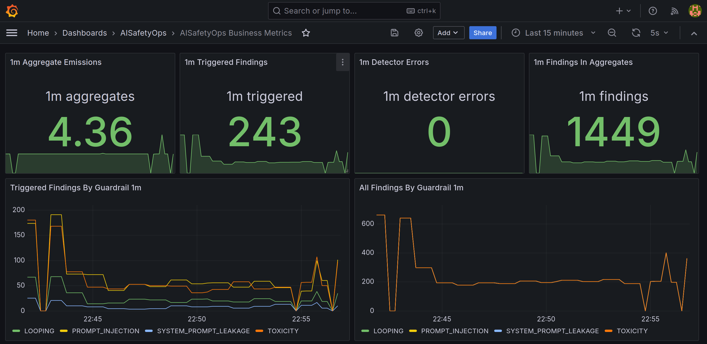
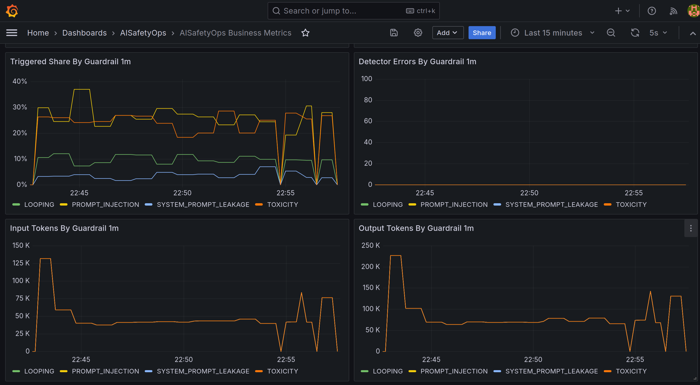
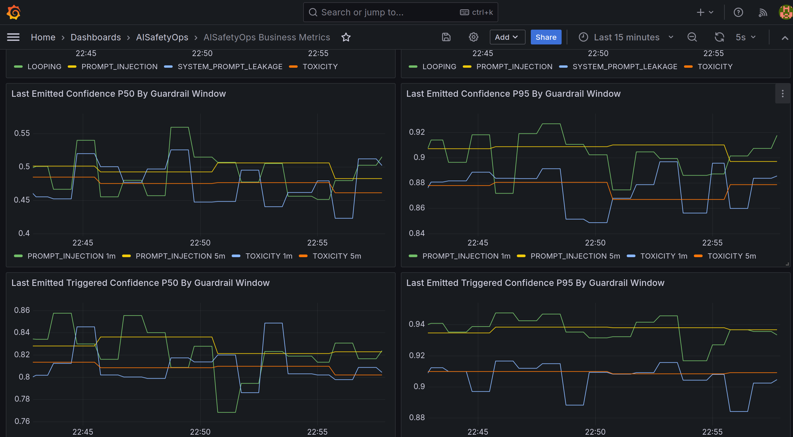
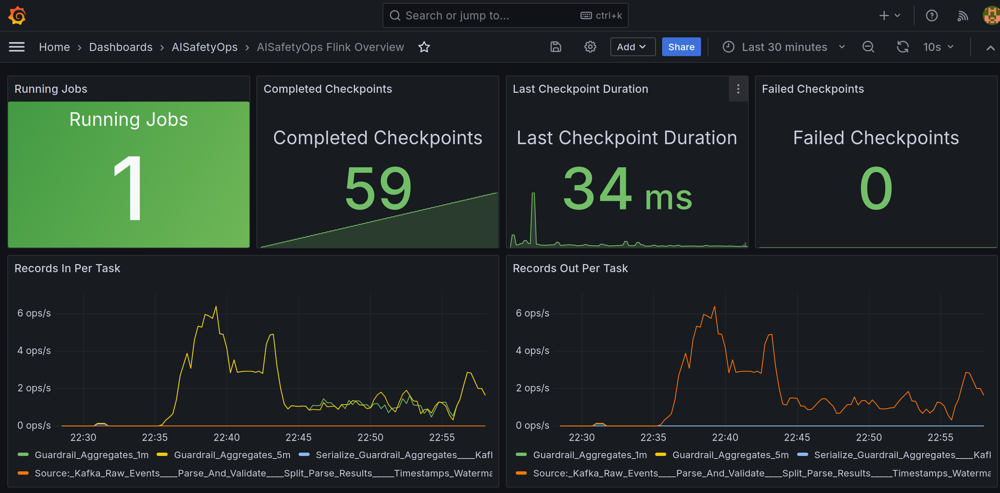
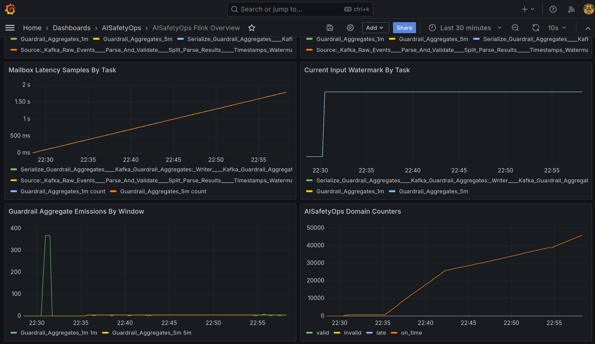

# AIRiskOps Flink MVP

Дата актуальности: 2026-09-04

## Назначение

Этот репозиторий содержит локальный MVP для NRTP-обработки событий AIRiskOps на Apache Flink.

Система предназначена для:

- приёма событий LLM-агентов и guardrail detectors из Kafka;
- нормализации и валидации входного потока;
- отделения `invalid` и `late` событий;
- оконной агрегации findings по `1m` и `5m`;
- публикации агрегатов и operational metrics в Kafka, Prometheus и Grafana;
- локальной разработки и demo на ноутбуке через Docker перед переносом в банковскую инфраструктуру.

Текущий доменный фокус:

- `PROMPT_INJECTION`
- `TOXICITY`
- `LOOPING`
- `SYSTEM_PROMPT_LEAKAGE`

## Prerequisites

Для локального запуска и проверки репозитория нужны:

- `Linux` или совместимая Unix-like среда с `bash`
- `Docker` с поддержкой `docker compose`
- `Java 17`
- `Maven`
- `Python 3`
- доступ к локальным портам `3000`, `8081`, `9090`, `9092`, `9249`, `9250`

Что используется на практике:

- `Docker` и `docker compose` нужны для Kafka, Flink, Prometheus и Grafana
- `Maven` нужен для сборки `flink-job`
- `Python 3` нужен для replay/live generators и их локальных тестов

## Supported Setup

На текущем этапе официально поддерживается такой сценарий:

- локальный запуск на одной машине;
- single-node Docker-based контур;
- `Kafka`, `Flink JobManager`, `Flink TaskManager`, `Prometheus`, `Grafana` в `docker compose`;
- локальная сборка job через `Maven`;
- локальные replay и live generators через `Python 3`.

Что важно понимать:

- это `local MVP`, а не production deployment;
- контур рассчитан на локальную разработку, demo и инженерную валидацию;
- текущие команды и runbook ориентированы именно на локальную машину, а не на Kubernetes или managed Flink;
- Grafana credentials `admin/admin` предназначены только для локального стенда.

## Flink Version

Текущий MVP использует `Apache Flink 1.20.2`.

Это зафиксировано в двух местах:

- Maven runtime и test dependencies в [flink-job/pom.xml](flink-job/pom.xml);
- Docker images `jobmanager` и `taskmanager` в [deployment/local/docker-compose.yml](deployment/local/docker-compose.yml).

Что важно:

- в экосистеме уже существует ветка `Flink 2.x`;
- этот репозиторий пока намеренно остается на `1.20.2`;
- причина прагматическая: для MVP важнее стабильный локальный стенд, предсказуемая совместимость коннекторов и воспроизводимый demo/runtime path.

## Quick Start

### Быстрый локальный старт

Если нужно быстро поднять локальный контур без очистки существующего state:

```bash
bash tools/scripts/init.sh
```

Что делает скрипт:

- поднимает Kafka, Flink, Prometheus, Grafana и checkpoint exporter;
- создает Kafka topics;
- загружает bootstrap policy;
- собирает job jar;
- отправляет Flink job в локальный кластер.

Если нужен тот же локальный сценарий, но с `RocksDB` runtime profile:

```bash
bash tools/scripts/init.sh --config config/job/local-rocksdb.yaml
```

Что меняется в этом режиме:

- submit идёт с profile `config/job/local-rocksdb.yaml`;
- job включает `RocksDB state backend`;
- `incremental checkpoints` включены;
- local state, checkpoints и savepoints пишутся в `runtime/flink-state/`.

После этого можно загрузить данные:

```bash
bash tools/scripts/run-replay.sh --scenario mixed --requests 120 --sessions 12 --agent-id agent-risk-01
```

Быстрая проверка результатов:

```bash
bash tools/scripts/check-output-topics.sh
```

Интерфейсы локального стенда:

- Flink UI: `http://localhost:8081`
- Prometheus: `http://localhost:9090`
- Grafana: `http://localhost:3000`

### Полная проверка с нуля

Если нужен полный destructive end-to-end smoke test с очисткой локального state:

```bash
bash tools/scripts/run-e2e-smoke.sh
```

Для неинтерактивного запуска:

```bash
bash tools/scripts/run-e2e-smoke.sh --yes
```

Этот сценарий:

- очищает локальное Docker и runtime state;
- поднимает стенд заново;
- собирает и отправляет job;
- публикует стартовый replay dataset;
- проверяет Kafka outputs, Prometheus и Grafana.

## Нагрузочное тестирование

Для воспроизводимого baseline-прогона используйте live generator и wrapper
отчёта:

```bash
bash tools/scripts/run-nt-baseline.sh \
  --duration-seconds 600 \
  --rps 50 \
  --recovery-seconds 60 \
  --report-dir runtime/load-tests
```

Скрипт создаёт Markdown-отчёт, raw JSON, лог генератора, три snapshot Kafka
lag и snapshots checkpoint в `runtime/load-tests/`. В консоль выводятся пути
артефактов, ссылки на Flink, Grafana и Prometheus, а также команды просмотра
Docker logs.

Пошаговый сценарий запуска, выбор DEFAULT/RocksDB profile и интерпретация
результата описаны в [runbook НТ](docs/runbooks/mvp-runbook.md). Полный план
НТ: RPS-ступени, сценарии, критерии деградации и определения метрик находятся
в [плане нагрузочного тестирования](docs/mvp/load-testing-plan.md).

## Архитектура репозитория

Репозиторий разделён по зонам ответственности, чтобы runtime-код Flink не смешивался с observability, tooling и документацией.

```text
.
├── flink-job/
├── deployment/
├── observability/
├── tools/
├── docs/
├── config/
├── runtime/
├── pom.xml
└── README.md
```

### `flink-job/`

Java-модуль с production-кодом Flink job.

Что лежит внутри:

- `src/main/java` — доменная модель, application logic и infrastructure adapters;
- `src/test/java` — unit и integration tests для Flink pipeline;
- `pom.xml` — Maven build для shaded job jar.

Собирать и тестировать нужно именно этот модуль.

Покрытие тестами для `flink-job` собирается через `JaCoCo`:

- регрессия печатает итоговое `line coverage` в консоль при каждом запуске `bash tools/scripts/run-regression.sh`;
- минимальный порог для `flink-job` зафиксирован на уровне `80%`;
- HTML-отчёт доступен в `flink-job/target/site/jacoco/index.html`.

### `deployment/`

Файлы локального окружения.

Сейчас:

- `deployment/local/docker-compose.yml`

Назначение:

- поднять локальный Kafka;
- поднять Flink JobManager и TaskManager;
- поднять Prometheus, Grafana и checkpoint exporter;
- смонтировать собранный JAR и job config в контейнеры.
- смонтировать локальный runtime state path `runtime/flink-state` для optional RocksDB profile.

### `observability/`

Всё, что относится к наблюдаемости.

Подкаталоги:

- `observability/prometheus/`
- `observability/grafana/`

Назначение:

- хранить `prometheus.yml`;
- хранить provisioning Grafana;
- хранить dashboards AIRiskOps;
- отделять observability-артефакты от runtime-кода job.

## Скриншоты Observability

Ниже приведены актуальные примеры Grafana dashboards локального MVP.

### Business Dashboard: верхняя часть

Показывает основные NRT business-метрики за последнюю минуту:

- число emitted aggregates;
- число triggered findings;
- detector errors;
- общее число findings, попавших в оконную аналитику;
- разрез по guardrail для triggered и all findings.



### Business Dashboard: доли и токены

Показывает:

- `Triggered Share By Guardrail 1m`;
- `Detector Errors By Guardrail 1m`;
- входные токены по guardrail;
- выходные токены по guardrail.

Это полезно для понимания чувствительности правил и объёма трафика, который проходит через detectors.



### Business Dashboard: confidence percentiles

Показывает последние эмитированные percentile-метрики для `PROMPT_INJECTION` и `TOXICITY`:

- `Last Emitted Confidence P50 By Guardrail Window`;
- `Last Emitted Confidence P95 By Guardrail Window`;
- `Last Emitted Triggered Confidence P50 By Guardrail Window`;
- `Last Emitted Triggered Confidence P95 By Guardrail Window`.

Этот экран нужен для контроля типичного и хвостового confidence по окнам `1m` и `5m`.



### Flink Overview: runtime summary

Показывает базовое состояние job:

- `Running Jobs`;
- `Completed Checkpoints`;
- `Last Checkpoint Duration`;
- `Failed Checkpoints`;
- входной и выходной throughput по task.

Это первый экран для проверки, что job жива и поток реально проходит через topology.



### Flink Overview: watermarks и emissions

Показывает:

- `Mailbox Latency Samples By Task`;
- `Current Input Watermark By Task`;
- `Guardrail Aggregate Emissions By Window`;
- `AIRiskOps Domain Counters`.

Этот экран помогает понять, движется ли event time, закрываются ли окна и не деградирует ли pipeline на runtime-уровне.



### `tools/`

Вспомогательные скрипты и генераторы.

Подкаталоги:

- `tools/scripts/` — operational shell scripts;
- `tools/generators/` — Python-генераторы replay и live stream;
- `tools/tests/` — Python tests для генераторов.
- `tools/testdata/` — только маленькие фиксированные test fixtures, если они реально нужны.

Назначение:

- запускать локальный стенд;
- инициализировать topics;
- публиковать replay dataset;
- генерировать живой поток для Grafana;
- прогонять локальный regression.

Правило хранения данных:

- runtime replay datasets не хранятся в git;
- всё, что можно воспроизвести генератором, должно генерироваться;
- в репозитории допустимы только маленькие fixture-наборы для тестов.

### `docs/`

Вся проектная документация.

Подкаталоги:

- `docs/architecture/`
- `docs/monitoring/`
- `docs/runbooks/`
- `docs/mvp/`

Назначение:

- manual по Flink и AIRiskOps;
- monitoring/debugging guides;
- local walkthrough и runbooks;
- MVP spec и результаты инкрементов.

### `config/`

Конфигурация, которая используется job и локальным стендом.

Подкаталоги:

- `config/job/`
- `config/policies/`

Назначение:

- хранить YAML job config;
- хранить policy defaults;
- не смешивать конфиги с кодом и скриптами.

### `runtime/`

Локальные runtime-данные, которые создаются во время работы.

Примеры:

- `runtime/replay/latest/`
- `runtime/policies/`

Содержимое runtime не считается исходным кодом и может очищаться cleanup-скриптами.

## Архитектура Java-модуля `flink-job`

Внутри `flink-job` используется целевая слоистая схема:

- `model`
- `app`
- `infra`

Это основной корпоративный layout для развития проекта.

### `com.bank.airiskops.model`

Доменная модель и общие константы.

Примеры:

- `SafetyEvent`
- `GuardrailWindowAggregate`
- `InvalidEvent`
- `LateEvent`
- `EventType`
- `GuardrailNames`
- `WindowNames`

Назначение пакета:

- задавать контракты данных между этапами pipeline;
- хранить модели, не завязанные на конкретный source/sink;
- держать domain vocabulary в одном месте.

### `com.bank.airiskops.app`

Application layer: orchestration и бизнес-логика Flink job.

Подпакеты:

- `app/job`
- `app/usecase`
- `app/functions`
- `app/config`
- `app/support`

#### `app/job`

Точка входа в приложение.

Сейчас:

- `AiRiskOpsMvpJob`

Назначение:

- прочитать конфигурацию;
- создать `StreamExecutionEnvironment`;
- передать управление topology builder;
- запустить job.

#### `app/usecase`

Сборка topology под конкретный инкремент или use case.

Сейчас:

- `IncrementOneTopologyBuilder`

Назначение:

- описывать полный dataflow;
- задавать порядок операторов;
- выделять бизнес-этапы пайплайна;
- удерживать main topology readable и testable.

#### `app/functions`

Пользовательские Flink operators и window logic.

Примеры:

- `ParseAndValidateFunction`
- `SplitParseResultsFunction`
- `RouteLateEventsFunction`
- `GuardrailAggregateKeySelector`
- `GuardrailWindowAggregateFunction`
- `GuardrailWindowProcessFunction`
- `SerializeGuardrailAggregateFunction`

Назначение:

- инкапсулировать отдельные шаги обработки;
- отделять parsing, routing, window aggregation и serialization;
- делать операторную логику изолированной для unit/integration tests.

#### `app/config`

Конфигурационные модели и чтение аргументов job.

Примеры:

- `JobConfig`
- `JobConfigOptions`
- `OutputTopics`

Назначение:

- централизовать имена параметров;
- собирать config из CLI и YAML;
- не размазывать строковые ключи и defaults по коду.

#### `app/support`

Технические константы topology и runtime defaults.

Примеры:

- `JobTopology`
- `FlinkEnvironmentDefaults`

Назначение:

- хранить `uid`, `name`, output tags и runtime defaults;
- обеспечивать стабильность topology для UI, metrics и future savepoint compatibility.

### `com.bank.airiskops.infra`

Infrastructure adapters для внешнего мира.

Подпакеты:

- `infra/source`
- `infra/sink`
- `infra/parser`
- `infra/serde`
- `infra/config`

#### `infra/source`

Factory и адаптеры чтения данных.

Сейчас:

- `KafkaSourceFactory`

Назначение:

- строить Flink source из внешнего транспорта;
- изолировать connector-specific код от business logic.

#### `infra/sink`

Factory и адаптеры записи данных.

Сейчас:

- `KafkaSinkFactory`

Назначение:

- создавать Kafka sinks;
- инкапсулировать delivery guarantees и serialization binding.

#### `infra/parser`

Parsing входного JSON и промежуточные parse-result объекты.

Сейчас:

- `SafetyEventParser`
- `ParseResult`

Назначение:

- отделять raw ingestion от нормализованной доменной модели;
- локализовать schema parsing и validation concerns.

#### `infra/serde`

Сериализация доменных объектов.

Сейчас:

- `JsonSerde`

Назначение:

- централизованно преобразовывать модели в JSON;
- упростить замену transport format позже.

#### `infra/config`

Чтение конфигурации из внешних файлов.

Сейчас:

- `YamlJobConfigLoader`

Назначение:

- изолировать YAML loading от application logic;
- дать единый вход для конфигурации job.

## Текущий dataflow

Текущий MVP pipeline выглядит так:

1. Kafka source читает raw JSON события из входных topics.
2. `ParseAndValidateFunction` парсит и валидирует payload.
3. `SplitParseResultsFunction` разделяет valid и invalid поток.
4. `RouteLateEventsFunction` после watermark assignment отделяет late события.
5. Valid on-time события публикуются в `normalized-events`.
6. Поток `GUARDRAIL_FINDING` фильтруется отдельно.
7. Для findings считаются tumbling event-time окна `1m` и `5m`.
8. `GuardrailWindowProcessFunction`:
   - формирует `GuardrailWindowAggregate`;
   - обновляет AIRiskOps metrics;
   - эмитит агрегаты downstream.
9. Агрегаты сериализуются и пишутся в `guardrail-aggregates`.
10. Из агрегатов вычисляются `GuardrailQualityMetric` и публикуются в `guardrail-quality-metrics`.
11. Triggered findings соединяются с runtime policy updates через broadcast state.
12. `PolicyAwareSessionIncidentEvaluatorFunction` формирует `BasicIncident` и публикует его в `basic-incidents`.

## Основные команды

Сборка:

```bash
bash tools/scripts/build-job.sh
```

Регресс:

```bash
bash tools/scripts/run-regression.sh
```

Поднять локальный стенд:

```bash
bash tools/scripts/start-local.sh
```

Неразрушающе инициализировать локальный контур и job:

```bash
bash tools/scripts/init.sh
```

Инициализировать topics:

```bash
bash tools/scripts/init-topics.sh
```

Загрузить policy:

```bash
bash tools/scripts/load-policies.sh
```

Отправить job:

```bash
bash tools/scripts/submit-job.sh
```

Запустить replay:

```bash
bash tools/scripts/run-replay.sh --scenario mixed --requests 120 --sessions 12 --agent-id agent-risk-01
```

Запустить live generator:

```bash
bash tools/scripts/run-live-generator.sh --duration-seconds 300 --min-requests-per-second 1 --max-requests-per-second 5
```

Запустить destructive e2e smoke:

```bash
bash tools/scripts/run-e2e-smoke.sh
```

Остановить и очистить локальный контур:

```bash
bash tools/scripts/cleanup-local.sh
```

## Где смотреть дальше

- Архитектурный manual:
  - [docs/architecture/airiskops-manual.md](docs/architecture/airiskops-manual.md)
- Manual по добавлению новых агрегированных метрик:
  - [docs/architecture/adding-n-minute-metrics.md](docs/architecture/adding-n-minute-metrics.md)
- Monitoring и debugging:
  - [docs/monitoring/monitoring-debugging-guide.md](docs/monitoring/monitoring-debugging-guide.md)
- Local walkthrough:
  - [docs/runbooks/local-walkthrough.md](docs/runbooks/local-walkthrough.md)
- MVP runbook:
  - [docs/runbooks/mvp-runbook.md](docs/runbooks/mvp-runbook.md)
