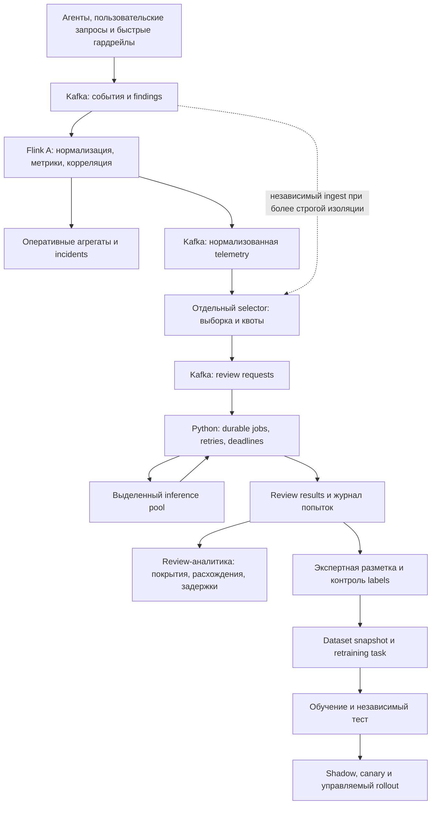

# Потоковая оценка и дообучение LLM-гардрейлов при 50K+ RPS

## 1. Тема, границы и доказательная база

Отчёт рассматривает архитектуру внутренней системы крупного коммерческого банка: сбор результатов быстрых гардрейлов, оперативная аналитика Apache Flink, перепроверка выбранных событий более сильными моделями и формирование заданий на дообучение. Дата исследования — **13 сентября 2026 года**. Базовое допущение — модели и чувствительные данные находятся в банковском on-prem/private-cloud контуре; внешний inference рассматривается как дополнительный вариант.

Это аналитический документ и предложение целевой архитектуры, **не утверждённая спецификация и не описание уже реализованного review-сервиса**. Сведения о текущем AIRiskOps выделены отдельно. Обязательные требования конкретного регулятора не выводятся из технических публикаций: юрисдикция банка и внутренняя нормативная база не заданы.

В отчёте различаются три уровня доказательств:

- **Эксплуатационный кейс:** инженерная публикация разработчиков с описанием действующей системы. Числа принадлежат её workload и конфигурации.
- **Документированный механизм / исследование:** официальная документация, исходный проект или авторская научная публикация. Это не обязательно доказательство эксплуатации при 50K RPS.
- **Инженерное предложение / расчёт:** применение механизмов к банковскому сценарию. Числа в capacity-примерах являются допущениями, а не benchmark.

Публичного первичного источника, одновременно подтверждающего **банковский production, Flink, 50K+ пользовательских запросов/с, LLM-гардрейлы, медленную перепроверку и замкнутый цикл дообучения**, в изученной выборке не найдено. Доступны сильные доказательства отдельных частей. Их соединение требует собственной проверки, а не переноса чужой цифры throughput.

Для применимости к репозиторию использована база Java 17, Flink **1.20.2**, Kafka image **3.8.1**. Документация ветки `release-1.20` на момент чтения отображает **1.20.3**: общие механизмы применимы к ветке, но исправления patch-релиза нельзя считать уже присутствующими в 1.20.2. Для autoscaler использована документация Kubernetes Operator **1.12**, для примеров serving — vLLM **0.18.0**. Эти версии служат воспроизводимыми ссылками, не рекомендацией закрепить их как последние доступные релизы.

## 2. Краткий инженерный вердикт

Для AIRiskOps разумна архитектура из трёх контуров с независимым масштабированием:

1. **Оперативный:** Kafka → Flink → агрегаты, состояние детекторов и incidents. Обрабатывает полный поток, имеет собственный NRT SLO.
2. **Перепроверка:** отбор кандидатов → durable review queue → Python workers → inference server → версионированные review results. Обрабатывает ограниченный поток, имеет собственный бюджет и deadline.
3. **Обучение:** результаты моделей и экспертов → версионированный датасет → задание на обучение → независимая оценка → shadow/canary rollout.

Формула устойчивости: **скорость каждого обязательного этапа должна превышать поступление на этот этап, а задержка медленной перепроверки не должна определять watermark и доступность оперативной аналитики**.



Связь между контурами сохраняется через идентификаторы и версии. Новая оценка обогащает историю решения. Ей не нужно повторно проходить через исходное пятиминутное окно как якобы своевременное finding.

Это также уточняет важную границу: **ветка внутри одного Flink job не является полноценной изоляцией**. Медленный async operator, общий sink, исчерпание network buffers или failure/recovery могут затронуть общих upstream-операторов. Kafka между независимыми jobs изолирует темп потребления, пока хватает retention, broker capacity и выделенных ресурсов. Изоляция compute не устраняет общий отказ Kafka, сети или object storage.

## 3. Что действительно сделано в практических системах

### 3.1. Streaming-платформы и NRT

| Реализация | Подтверждённые данные | Полезный механизм | Ограничение переноса |
|---|---|---|---|
| Uber AthenaX, 2017 | Более 220 приложений; отдельные приложения — до нескольких миллионов сообщений/с на восьми YARN containers по данным авторов | SQL-компиляция в Flink, ранняя фильтрация, оконные агрегаты, управление ресурсами | Старый workload; нет достаточного hardware/payload/state описания для расчёта банковского кластера. Масштаб Kafka-платформы не равен throughput одного job. [1 — Uber](https://www.uber.com/us/en/blog/athenax/) |
| Stripe Usage-Based Billing, 2025 | Pipeline ingest до 100K events/s на клиента; Flink для обработки; active-active по регионам | Единая metadata до разветвления, reconciliation; быстрый тракт с окном 30 с и медленный с окном 5 мин | Это billing events, не LLM-запросы; нет публичной спецификации полного кластера и стоимости на событие. [2 — Stripe](https://stripe.com/blog/how-we-built-it-usage-based-billing) |
| Uber Ads, 2021 | Сотни миллионов ad events в неделю; минутные окна и checkpoint interval 2 минуты | Kafka transactions, `read_committed`, идентификаторы для downstream idempotency, Pinot upsert | Недельный объём не доказывает 50K/s. Особенно полезен опыт задержки видимости результатов из-за commit. [3 — Uber Ads](https://www.uber.com/us/en/blog/real-time-exactly-once-ad-event-processing/) |
| Reddit Ad Events Validator, 2025 | Тысячи engagement events/s; multi-TB state; checkpoint timeout 15 минут до оптимизации | Allowlist полей, короткий hot state и Cassandra для длинного хвоста; Async I/O для редких lookup | Пример сложности состояния, а не рекорд RPS. После фильтрации bytes-out уменьшились на 90%; recovery проверяли после двухчасового простоя с целью 2× peak throughput. [4 — Reddit Engineering](https://www.reddit.com/r/RedditEng/comments/1ijcfge/scaling_our_apache_flink_powered_realtime_ad/) |
| Netflix autoscaling, август 2026 | Более 30K Flink jobs; переход к per-vertex scaling | Оценка true processing rate через busy time, учёт restart и sink limits | Часть доработок находится во внутреннем fork. Авторы используют utilization 0.45 для стабильности своих stateful jobs; это не универсальный default. [5 — Netflix](https://netflixtechblog.com/a-tale-of-two-flink-autoscalers-e9f6a1b1492b) |

Stripe особенно близок к требованию NRT: авторы сообщают p95 менее 30 с для time-sensitive операций и примерно пять минут от ingest до rated output для большинства сценариев. Это пример разделения оперативной свежести и более полного учёта; он не доказывает, что произвольное пятиминутное окно обеспечивает пятиминутный SLO для каждого события. [2 — Stripe](https://stripe.com/blog/how-we-built-it-usage-based-billing)

Общий инженерный вывод: масштаб обеспечивается сокращением данных до дорогих стадий, контролем state, независимым масштабированием и проверяемым восстановлением. Увеличение количества slots само по себе не решает проблему горячего ключа, бесконечного accumulator или недоступной модели.

### 3.2. Каскады, перепроверка и обучение

| Реализация | Практика и результат источника | Что применимо к банку |
|---|---|---|
| DoorDash SafeChat, октябрь 2025 | Каскад из moderation filter, быстрого LLM и точного LLM; после накопления около 10 млн data points обучена внутренняя модель. Во второй версии она обслуживает 99.8% сообщений; остаток эскалируется. Для большинства ответ первого слоя <300 мс, сложные случаи могут занимать до 3 с | Наиболее близкий эксплуатационный пример «дорогая проверка → накопление данных → дешёвая обученная модель». Это синхронная модерация чата, не Flink и не подтверждение 50K RPS. [6 — DoorDash](https://careersatdoordash.com/blog/doordash-safechat-ai-safety-feature/) |
| Google Ads, WSDM 2024 | Funneling, dedup, отбор представителей, LLM labels и propagation. 400 млн изображений за 30 дней сведены к менее 0.1% прямых LLM reviews; авторы сообщают 2× recall относительно baseline | Отбирать разнообразные примеры до дорогой модели. Результат получен на image ads и политике Non-Family Safe; сходство текстов prompt injection не гарантирует одинаковую метку. [7 — Google Ads](https://arxiv.org/html/2402.14590v1) |
| Anthropic Constitutional Classifiers++, январь 2026 | Дешёвый probe внутренних активаций → более мощный classifier/ensemble; обмен рассматривается с контекстом входа и выхода. Около 1% compute overhead для оценённого Opus workload; benign refusal 0.05% в месячном deployment на Sonnet 4.5 | Каскад и контекст полезны. Доступ к внутренним активациям proprietary model обычно отсутствует; цифры разных workloads нельзя складывать в один benchmark. Задача CBRN/jailbreak не тождественна банковскому PI. [8 — Anthropic](https://www.anthropic.com/research/next-generation-constitutional-classifiers) |
| Pinterest, 2024–2025 | LLM teacher, расширение labels и distillation в модель, пригодную для real-time serving | Практическая опора для teacher–student lifecycle, но источник относится к search relevance. [9 — авторская работа Pinterest](https://arxiv.org/abs/2410.17152) |
| LangSmith online evaluation | Filters, sampling, версия evaluator, фоновые проверки production traces, backfill | Готовый паттерн управления выбранными evaluations; это документация продукта, без доказанного SLO на 50K/s. [10 — LangSmith](https://docs.langchain.com/langsmith/online-evaluations-llm-as-judge) |
| NVIDIA NeMo Guardrails evaluation | Отдельные определения policies, interactions и judge; измерение compliance, ресурсов и latency | Полезен evaluation harness с общей rubric и воспроизводимым сравнением. Не заменяет Kafka scheduling и банковское управление датасетами. [11 — NVIDIA](https://docs.nvidia.com/nemo/guardrails/evaluation/evaluate-configuration) |

Указанные проценты — результаты соответствующих авторов. В частности, переход DoorDash к двум слоям не означает, что для банковского PI достаточно отправлять на сильную модель ровно 0.2% запросов. Доля эскалации определяется собственной ROC/PR-кривой, содержанием потока и ресурсным бюджетом.

### 3.3. Прямая интеграция Flink с моделями существует, но её пределы важны

AWS опубликовала реализацию: streaming source → Flink с deduplication и вызовом embedding model → OpenSearch; LLM отвечает в отдельном RAG-потоке. Это показывает реализуемость model enrichment внутри streaming application. Публикация не содержит доказательства, что медленная judge-модель обрабатывает 50K запросов/с или сохраняет пятиминутный deadline при её отказе. [12 — AWS implementation](https://aws.amazon.com/blogs/big-data/uncover-social-media-insights-in-real-time-using-amazon-managed-service-for-apache-flink-and-amazon-bedrock/)

Поэтому вопрос «можно ли вызвать модель из Flink» решён положительно. Вопрос для банка другой: какая зависимость по latency, стоимости, повторным вызовам и отказам допустима между моделью и оперативным контролем.

## 4. Уровень 1 — единицы нагрузки и физические ограничения

### 4.1. 50K requests/s и 50K records/s — разные системы

Для одного пользовательского запроса возможны request, response, несколько findings, события retrieval, tool calls, retries и оценки выходных сообщений. В агентном workflow количество model invocations также может превышать количество пользовательских запросов.

Расчётная модель:

```text
R_records = R_user × E[records per user request]
B_ingest = Σ(rate_i × mean_serialized_size_i)
N_5min = R_records × 300
V_day = B_ingest × 86 400
```

Ниже — **иллюстративный расчёт**, не измерение AIRiskOps. Размер одной записи принят равным 2,000 bytes; GB/TB десятичные; compression, headers и дополнительные outputs исключены.

| Сценарий | Records/s | Records за 5 мин | Вход MB/s | Логический вход TB/сутки | Объём за 5 мин при RF=3, GB |
|---|---:|---:|---:|---:|---:|
| 50K означает Kafka records/s | 50,000 | 15,000,000 | 100 | 8.64 | 90 |
| 50K user requests/s, по 6 records/request | 300,000 | 90,000,000 | 600 | 51.84 | 540 |

При RF=3 последний столбец отражает суммарные байты трёх копий входного лога. Это не размер Flink state и не точная потребность network bandwidth: replication traffic, consumer reads, TLS, compression, repeated outputs и checkpoint uploads считаются отдельно. Пересчитываемые сценарии приложены в [capacity CSV](guardrail-review-capacity.csv).

**Решение перед sizing:** раздельно измерить request rate, detector invocation rate, Kafka record rate и token rate. Если быстрые гардрейлы уже вычисляются upstream, Flink обрабатывает результаты. Если их inference переносится в AIRiskOps, это новая отдельная нагрузка CPU/GPU.

### 4.2. Производительность определяется самым дорогим обязательным этапом

Для оператора с устойчивой измеренной производительностью `q` records/s на subtask:

```text
P >= ceil(R_operator / (q × target_utilization))
```

Например, при `q=5,000/s`, входе `50,000/s` и целевой загрузке `0.6` нужно минимум 17 subtasks **этого оператора**. Это вычисление не определяет количество серверов, GPU и Kafka partitions. Его нарушают skew, зависимость q от parallelism и ограничения downstream.

Отдельно проверяется горячий ключ: `rate(hot_key) < capacity(single keyed subtask)`. Один крупный агент может перегрузить одну subtask, даже если средняя загрузка кластера мала. Для mergeable агрегатов возможны локальные partial aggregates по salted key и последующее объединение. Для session rules и similarity cluster произвольное salting меняет корреляцию и требует отдельного алгоритма.

### 4.3. Бюджет медленной модели

Считать review rate следует относительно конкретной популяции. Если на пользовательский запрос приходится одна PI-проверка:

```text
R_review = R_PI × [p_trigger × s_positive + (1-p_trigger) × s_negative]
```

К этому добавляются дополнительные политики, повторные оценки, ручные запросы и retries. Dedup и clustering меняют фактический rate, поэтому сокращение нельзя считать гарантированным до измерения.

При `R_PI=50,000/s` и среднем inference time 8 с:

| Доля всех PI-проверок, отправляемых judge | Reviews/s | Reviews/сутки | Среднее число одновременных inference по Little's law |
|---|---:|---:|---:|
| 100% | 50,000 | 4,320,000,000 | 400,000 |
| 1% | 500 | 43,200,000 | 4,000 |
| 0.1% | 50 | 4,320,000 | 400 |
| 0.01% | 5 | 432,000 | 40 |

Это расчёт `L=λ×E[service_time]` для устойчивого режима и времени именно inference, без ожидания в очереди. Он не доказывает p99 latency и не переводится напрямую в число GPU. При batching разные concurrency дают разную длительность обработки.

Если trigger rate равен 1% и перепроверяются все сработки, сильная модель получает уже 500 reviews/s. Добавление случайных 0.1% отрицательных результатов даёт ещё 49.5/s. «Только сработки» всё ещё может означать десятки миллионов inference в сутки.

Для модельного pool обязательны измерения `input_tokens/s`, `output_tokens/s`, time-to-complete, распределения context length и GPU memory. При 100 reviews/s, 4,000 input tokens и 256 output tokens каждый потребуется обслуживать 400K input tokens/s и 25.6K output tokens/s. Это не эквивалентные единицы вычисления: prefill и autoregressive decode имеют разные профили.

## 5. Уровень 2 — NRT за пять минут, hot path и state

### 5.1. Три разных значения «5 min»

| Требование | Точная формулировка | Архитектурное последствие |
|---|---|---|
| Окно анализа | Считать риск за последние 300 секунд event time | Rolling/hopping aggregates либо buckets с периодическим объединением |
| Свежесть мониторинга | Событие отражено в оперативной картине не позднее чем через 300 секунд | Нужен end-to-end SLO, включая Kafka lag и sink visibility |
| Срок перепроверки | Выбранное событие получило проверенный результат judge за 300 секунд | Нужны admission control, отдельная очередь, inference capacity и budget на retry |

Пятиминутное tumbling window со стандартным event-time trigger выдаёт первый результат после достижения watermark конца окна. Allowed lateness сохраняет состояние для возможных исправлений; она **не означает обязательного ожидания ещё пяти минут перед первой выдачей**. Повторные late firings могут обновлять ранее выпущенный результат. [13 — Flink Windows](https://nightlies.apache.org/flink/flink-docs-release-1.20/docs/dev/datastream/operators/windows/)

Для текущего AIRiskOps с out-of-orderness 30 с событие в начале пятиминутного окна при достаточно непрерывном потоке может ждать примерно 5 мин + 30 с + watermark emission + processing/sink latency. Следовательно, одна такая настройка уже не гарантирует строгие 5 минут от события до первой видимости. Это аналитический вывод по текущим параметрам, не измеренный p99.

Предлагаемый вариант: хранить компактные buckets по 10–30 с, обновлять пятиминутный rolling view каждые 10–30 с и иметь отдельно final/corrected aggregates. Размер bucket, slide и политика revisions являются новыми semantics и должны быть согласованы. Для exact rolling event-time rules потребуется обработка граничных buckets; простое объединение полных buckets даёт дискретизированное окно.

Если бизнесу нужны именно календарные пятиминутки, можно оставить их и добавить ранние snapshots. Тогда downstream обязан различать partial, final и corrected версии по стабильному `aggregateId` и монотонной revision. Усреднять p95 нескольких buckets нельзя: объединяют histogram/sketch, после чего извлекают percentile.

### 5.2. End-to-end latency budget

Следующие значения — **предложение для acceptance-теста**, не установленный production SLO:

| Участок | Бюджет на выбранный review, с |
|---|---:|
| От события до durable telemetry | 20 |
| Отбор, доступность evidence, очередь | 100 |
| Inference и bounded retry | 120 |
| Запись результата и видимость в витрине | 20 |
| Резерв | 40 |
| Всего | 300 |

Суммирование бюджетов — способ планирования, а не математическое доказательство p99: процентили этапов обычно не складываются. Проверяется распределение полной задержки на сквозных timestamp. Для retrospective learning допустим другой deadline; для приоритетного NRT-review — отдельная квота и измеряемый SLO.

После длительной недоступности модели нельзя одновременно гарантировать полный охват, фиксированную capacity и завершение всех reviews за пять минут. Политика должна явно назначать `DEFERRED`, `EXPIRED` или переключать разрешённый класс задач в batch. Ни timeout, ни отсутствие результата не означают `BENIGN`.

### 5.3. Горячий тракт

| Этап | Основная работа | Где возникает стоимость / p99 | Предложение |
|---|---|---|---|
| Producer → Kafka | Сериализация, batch, compression, TLS, replicated log | Копирование bytes, network hops, broker I/O, ISR changes | Измерять bytes/s и append latency; фиксировать envelope, limits и acknowledgement policy |
| Kafka → parse | Fetch buffers, JSON/Avro/Protobuf decode, validation | Allocations, GC, длинные payload, malformed records | Рано проецировать поля; большие evidence передавать по защищённой ссылке |
| `keyBy` | Hash partitioning, сериализация и shuffle | Network buffers, skew, лишние repartition | Разные ключи для разных задач; избегать повторного shuffle без необходимости |
| Window/session state | Incremental updates, timers, snapshot | JNI/serialization для RocksDB, cache miss, compaction, GC на heap | Ограниченные структуры; измерение каждого stateful operator |
| Sink | Serialization, producer buffering, commit/upsert | Broker saturation и ожидание commit | Проверять реальную downstream visibility; обозначать revisions |
| Review selection | Sampling, lookup идентичного evidence, квоты | Hot agents/campaigns, cardinality, слишком дорогой semantic dedup | Дешёвый sampling и exact dedup до embedding; отдельный selector |
| Python → model | Context fetch, tokenization, batch scheduling, inference | Очередь, cold start, prefill, decode, KV-cache pressure | Отдельный GPU pool; bounded tokens/concurrency; deadline-aware scheduling |

Таблица описывает возможные расходы. Наличие конкретного syscall, NUMA bottleneck или disk read на каждом событии не утверждается: это проверяется profiling. RocksDB block-cache hit не равен дисковому I/O, Kafka acknowledgement не следует автоматически трактовать как отдельный `fsync` каждого record.

### 5.4. State: размер и цена обновления важнее названия backend

Для bounded агрегатов state приближённо зависит от числа активных key/window combinations и размера accumulator. Для списков всех confidence, request IDs или текстов он дополнительно растёт с числом событий. Поддержка `AggregateFunction` сама по себе не делает state ограниченным.

Варианты компактного состояния:

- Counts, sums, min/max — фиксированные счётчики.
- Confidence distribution — histogram с заранее заданными bins либо mergeable quantile sketch.
- Distinct counts — exact set только при доказанно малой cardinality; иначе отдельное согласование approximate semantics.
- Evidence — ограниченные representatives и references, а не история prompt-данных.
- Session state — TTL/таймеры и верхние границы размера; TTL не подменяет business event-time semantics.

KLL/REQ дают компромисс памяти и точности quantiles; их ошибка описывается в **rank**, а не как фиксированная ошибка значения confidence. Для confidence в `[0,1]` fixed histogram может быть проще для аудита, но это тоже приближение. Переход с exact percentile должен явно менять спецификацию метрик и пройти сравнение на контрольных распределениях. [14 — Apache DataSketches](https://datasketches.apache.org/docs/QuantilesAll/QuantilesOverview.html)

Heap backend подходит, когда bounded state помещается в память с запасом и GC/restore укладываются в требования. RocksDB позволяет хранить больше state и использовать incremental checkpoints, но добавляет serialization, JNI и native memory. Его cache и write buffers не исчерпывают всего RSS процесса: остаются network, JVM overhead и другие native allocations. [15 — Flink State Backends](https://nightlies.apache.org/flink/flink-docs-release-1.20/docs/ops/state/state_backends/)

**Выбор для банка:** сравнить heap и RocksDB на одинаковом входе, гарантиях доставки и зрелом состоянии. Не объявлять RocksDB обязательным только по RPS. При большом состоянии предпочесть durable remote checkpoints и быстрый локальный disk; local recovery использовать как ускорение, а не единственную копию.

### 5.5. Watermarks и длинный review

Watermark определяется прогрессом входов, а не желаемым SLA. Медленная или тихая partition может задерживать downstream; idleness помогает с тихими источниками. Source-level watermark strategy лучше использует знание splits/partitions, чем назначение после уже объединённого потока. Отдельно нужны проверки clock skew и недопустимого future event time. [16 — Flink Watermarks](https://nightlies.apache.org/flink/flink-docs-release-1.20/docs/dev/datastream/event-time/generating_watermarks/)

Для review следует хранить как минимум четыре времени: `sourceEventTime`, `enqueuedAt`, `reviewStartedAt`, `reviewCompletedAt`. Для оперативной загрузки очереди используется processing/wall-clock time; для оценки исходного detector — cohort по source event time.

Пример: finding возникло в 12:00, judge завершил оценку в 12:18. Оно относится к качеству detector в когорте 12:00, но к производительности review-сервиса в периоде 12:18. Перезапись event time на 12:18 исказит историю риска; возвращение записи в закрытое исходное окно потребует неуместно долгого state retention.

Практическое решение — отдельная review-аналитика с upsert/версированием cohort-метрик. Для короткого live join можно использовать bounded state, а для длинного хвоста — result store/lakehouse и backfill. Evidence обязано быть доступно раньше, чем истечёт окно его hot-cache; это особенно важно при независимом ingest.

### 5.6. Checkpoints, recovery и запас мощности

Официальная документация выделяет два условия устойчивого large-state processing: надёжное checkpointing и ресурс для догоняющей обработки после отказа. `min pause between checkpoints` предотвращает непрерывное выполнение snapshots; incremental checkpoints уменьшают повторное сохранение state, но не устраняют цену compaction/restore. [17 — Flink Large State Tuning](https://nightlies.apache.org/flink/flink-docs-release-1.20/docs/ops/state/large_state_tuning/)

Расчёт восстановления при постоянном входе:

```text
backlog = arrival_rate × outage_seconds
catch_up_seconds = backlog / (recovery_processing_rate - arrival_rate)
```

При входе 50K records/s и простое 120 с накопится 6 млн записей. При capacity 75K/s догоняющая обработка займёт ещё 240 с; при 100K/s — 120 с. Если capacity не превосходит вход, backlog не сокращается. В расчёт надо добавить replay от последнего checkpoint, restore и startup, если они ещё не включены в outage.

Условие `checkpoint duration << interval` полезно как цель экономии ресурсов, но не является универсальным инвариантом корректности. Важнее успешность и возраст последнего checkpoint, restore time, объём in-flight state и бюджет потерь свежести. Unaligned checkpoints помогают при задержке barriers из-за backpressure, но увеличивают I/O и не устраняют медленный inference. [18 — Checkpointing under backpressure](https://nightlies.apache.org/flink/flink-docs-release-1.20/docs/ops/state/checkpointing_under_backpressure/)

## 6. Встроить модель в Flink или вынести отдельно

| Вариант | Выигрыш | Цена / failure coupling | Когда выбирать |
|---|---|---|---|
| Синхронный вызов в `map/process` | Простой код, локальный порядок | Один долгий вызов занимает operator thread; ресурс модели определяет throughput | Только доказанно короткое локальное вычисление после benchmark |
| `Async I/O` в основном job | Параллельные запросы, интеграция с Flink recovery | Ограничение concurrency даёт backpressure; вызовы могут повториться после restore | Короткий enrichment с контролируемым tail и допустимой зависимостью |
| PyFlink operator в основном job | Повторное использование Python-логики | Python runtime/serialization/packaging; общие ограничения job и его state | Когда Python действительно нужен внутри общего dataflow, а его стоимость измерена |
| Отдельный Flink review job | Независимые offsets, окна, parallelism и deploy | Дополнительный job и Kafka boundary; retries модели всё равно проектируются | Сложный stateful отбор/корреляция, унифицированная эксплуатация Flink |
| Python Kafka workers + model serving | Независимый GPU pool, deadlines, durable retries, простое ML окружение | Нужно явно реализовать delivery/idempotency и управление задачами | Рекомендуемый старт для slow review и подготовки datasets |
| Batch из lake/object storage | Высокая утилизация ускорителей, воспроизводимый backfill | Не обеспечивает NRT сам по себе | Длинный хвост, исторический анализ, массовый rejudge |

В Flink Async I/O capacity ограничивает число запросов и при заполнении вызывает backpressure. Даже `unorderedWait` не пропускает watermark через незавершённые предшествующие records. Checkpoint сохраняет in-flight inputs; recovery повторно запускает запросы. Следовательно, Flink exactly-once для состояния **не гарантирует однократный внешний inference** или однократное списание за API. [19 — Flink Async I/O](https://nightlies.apache.org/flink/flink-docs-release-1.20/docs/dev/datastream/operators/asyncio/)

В proposed review-контуре отсоединяются **две границы**: очередь между operational stream и worker и отдельные ресурсы inference. Sidecar в одном pod без отдельного ресурсоограничения оставляет общие CPU/RAM failure modes. Разные deployments на одном насыщенном GPU также не обеспечивают нужную изоляцию.

Для пилота selector может читать существующий `normalized-events` своей consumer group. Это не требует добавления медленного вызова в Java job. Для production нужно решить, входит ли в review поздний и неполный telemetry: в AIRiskOps `normalized-events` записывается после late routing и не содержит всех валидных слишком поздних событий.

Если review обязан продолжаться при отказе основного Flink job, selector должен независимо читать исходные topics либо общий отдельно реализованный intake stream. Цена — общая библиотека/схема validation и контроль одинаковой интерпретации. Простое независимое чтение raw без versioned contract создаст две разные популяции наблюдений.

## 7. Как формировать перепроверку

### 7.1. Сначала определить, что именно классифицируется

Следует различать: наличие попытки prompt injection, нарушение content policy, успешность атаки, запрещённое tool action и факт утечки. Вредный запрос может не содержать injection; injection может выглядеть безобидно без trusted context; заблокированная атака не является false positive только потому, что ущерба не произошло.

Для agentic PI объект оценки часто шире строки prompt. Нужны пользовательская задача, границы доверия, релевантные system/developer instructions, источник retrieved content, tool arguments/results и фактическое действие. AgentDojo специально оценивает атаки и защиты в среде выполняющих инструменты агентов; InjecAgent — indirect injection в tool-integrated сценариях. Их можно использовать как внешние regression suites, дополнив банковскими задачами. [20 — AgentDojo](https://agentdojo.spylab.ai/), [21 — InjecAgent](https://arxiv.org/abs/2403.02691)

`evidenceSnippet` полезен для отбора и отображения, но не гарантирует достаточность контекста. Предложение «передавать только короткий безопасный фрагмент» необходимо уточнить: truncation или redaction способны удалить саму атаку либо основание считать строку разрешённой инструкцией. В таких случаях результат должен быть `INSUFFICIENT_CONTEXT`, а не уверенное отрицание.

### 7.2. Две выборки с разными целями

**Audit sample** нужна для оценки реального качества. Предлагается воспроизводимая случайная выборка из всех detector decisions, включая `triggered=false`, с вероятностью включения `samplingProbability`. Страты: detector/policy version, канал, язык, тип содержимого и бизнес-сегмент. Малые критичные страты получают минимальную квоту.

**Learning sample** нужна для поиска полезных примеров: расхождения detector/judge, confidence около действующего threshold, новые атаки, жалобы, новые версии, разнообразные clusters и ручные escalations. Это намеренно смещённая выборка; её статистику нельзя выдавать за качество всего потока.

Нельзя универсально фиксировать uncertainty как `confidence 0.4–0.7`: score может быть некалиброван, а threshold — иным для каждой версии. Правило отбора хранит score scale, версию threshold и конкретную sampling policy.

Для нескольких независимых способов отбора общая вероятность `1-Π(1-p_i)` корректна только при действительно независимых selections. Deterministic overrides, quotas и cluster selection нарушают такое допущение. На первом этапе проще поддерживать отдельную audit-выборку с известным дизайном и отдельную learning-очередь.

### 7.3. Deduplication и diversity

Порядок сокращения потока: eligibility → deterministic random sample/квоты → exact duplicate lookup → ограниченный diversity selection → дорогая модель. Для высокоприоритетных событий допускается отдельная защищённая квота.

Ключ повторного использования verdict должен учитывать content **и контекст**: detector invocation, trusted policy, роль сообщения, источник, нормализацию и judge version. Одинаковая строка в пользовательском сообщении и в tool response не всегда имеет одинаковый смысл. В metadata-контуре лучше применять tenant-scoped keyed digest; это не делает содержимое автоматически анонимным.

Практику Google Ads разумно перенести сначала в виде **выбора представителей**, без автоматического присвоения их labels всему кластеру. В dataset хранить `clusterId`, `clusterSize`, метод отбора и `labelOrigin`. Перед propagation нужны отдельные измерения чистоты кластеров на hard negatives и контекстных вариантах.

Существующая `SIMILAR_PROMPT_INJECTION_CAMPAIGN` в AIRiskOps группирует уже сработавшие PI findings по similarity evidence. Она может служить сигналом novelty/diversity, но её threshold и модель не валидированы как механизм массовой разметки.

### 7.4. Предлагаемый review contract

| Группа | Поля и смысл |
|---|---|
| Identity | `reviewId`, `sourceEventId`, `detectorInvocationId`, `traceId`, `requestId`; request ID недостаточен при нескольких вызовах детектора |
| Scope | `tenantId`, `agentId`, `environment`, channel и язык |
| Исходное решение | Detector/model artifact version, policy/threshold version, score, triggered, action, status |
| Evidence | `evidenceRef`, immutable content digest, `contextVersion`, trust-boundary annotations, truncation/redaction flags |
| Selection | `selectionPolicyVersion`, `selectionReason`, `sampleKind`, `samplingProbability`, cohort, cluster metadata |
| Execution | Pinned `judgeSpecVersion`, priority, timestamps, deadline, maximum attempts, token budget |

`reviewId` предлагается получать детерминированно из source identity, версии контекста и judge specification. Повторная доставка даёт тот же ID; намеренный rejudge новой моделью — другой. Формат serialization/hashing фиксируется в контракте. Если upstream ещё не имеет stable event ID, Kafka topic/partition/offset годится для идентификации конкретной доставки, но не распознаёт повторную публикацию того же business event.

Результат разделяет технический статус и смысл:

```text
executionStatus: SUCCEEDED | RETRYABLE_ERROR | PERMANENT_ERROR | EXPIRED
assessment: INJECTION | BENIGN | UNCERTAIN | INSUFFICIENT_CONTEXT
attackOutcome: SUCCEEDED | BLOCKED | UNKNOWN | NOT_APPLICABLE
labelOrigin: MODEL | HUMAN | PROPAGATED
```

Дополнительно: версии модели, rubric и prompt; evidence spans/reason codes; usage; duration; attempt ID; artifact digest; решение о передаче эксперту. `trainingEligible` определяется правилами dataset pipeline с учётом provenance и прав использования, а не единственным ответом judge.

## 8. Реализация Python review-сервиса

### 8.1. Worker orchestration и inference serving

Python worker управляет задачей: читает metadata, получает evidence, строит фиксированный запрос, валидирует structured output и сохраняет результат. Модель обслуживается отдельным долгоживущим inference server. Загрузка весов на каждое событие или каждым короткоживущим worker создаст cold-start и лишние копии памяти.

Для encoder/classifier полезно проверить dynamic batching; для generative judge — continuous batching, контекстный budget и ограниченную длину ответа. PagedAttention/vLLM создавались для более эффективного использования KV cache и увеличения доступного batch. Опубликованные ускорения зависят от моделей и baseline, поэтому не используются здесь для подсчёта GPU. [22 — PagedAttention, SOSP 2023](https://arxiv.org/abs/2309.06180)

В vLLM 0.18.0 chunked prefill распределяет budget между prefill и decode; недостаток KV cache вызывает preemption/recompute и влияет на latency. Для review следует измерять завершение полного вердикта, а не только TTFT. Подбирать `max_num_seqs`, `max_num_batched_tokens`, длины input/output и parallelism нужно на реальном распределении evidence. [23 — vLLM 0.18.0](https://docs.vllm.ai/en/v0.18.0/configuration/optimization/)

Рекомендуется ограничивать очередь также по ожидаемым tokens/work, а не только по count. Сто задач по 100K tokens и сто задач по 500 tokens имеют совершенно разный backlog. Длинные контексты можно выделить в отдельный pool, сохраняя fair scheduling и квоту критичных задач.

### 8.2. Два рабочих паттерна доставки

**Простой пилот:** consumer → bounded asynchronous workers → durable result → commit соответствующих offsets. Commit допускается только до непрерывной границы успешно сохранённых результатов; завершение offset 12 при незавершённом 11 не разрешает подтвердить 13. При restart возможны повторные inference, а `reviewId` обеспечивает dedup результата.

**Более управляемый production-паттерн:** consumer записывает задачу в durable inbox/job table с уникальным `reviewId`, затем подтверждает intake. Workers забирают jobs через lease, вызывают модель вне DB-транзакции и атомарно сохраняют результат плюс outbox. Outbox публикует результат в Kafka; downstream делает idempotent upsert. Для lease expiry нужен fencing token, чтобы старый worker не перезаписал результат нового владельца.

Это архитектурные варианты, а не требование обязательно добавлять SQL-БД. Durable workflow engine или stream-first retry topics также подходят, если сохраняют те же инварианты и измеримую стоимость эксплуатации.

Kafka transactions могут атомарно связать output records и consumed offsets, но не включают произвольный внешний inference или SQL write автоматически. Для transactional outputs потребители должны использовать `read_committed`. Оставлять Kafka-транзакцию открытой на всё время медленной модели нецелесообразно: зависнут visibility и timeout budget. Настройки poll/heartbeat и rebalance должны соответствовать конкретной Python client library; ожидание модели не должно останавливать consumer poll loop. [24 — Kafka 3.8 Consumer Config](https://kafka.apache.org/38/generated/consumer_config.html), [25 — Flink Kafka connector](https://nightlies.apache.org/flink/flink-docs-release-1.20/docs/connectors/datastream/kafka/)

Exactly-once business effect здесь означает одну принятую canonical assessment на `reviewId`; попыток inference может быть несколько. Их лучше хранить в audit log. Даже при temperature 0 повторная генерация не обязана быть побитово одинаковой: фиксируется политика принятия результата и явная процедура rejudge.

### 8.3. Overload и retry policy

Предлагаются отдельные квоты для urgent review, audit sample, learning sample и historical backfill. Backfill использует остаточную capacity, а audit-выборка получает защищённый минимум, чтобы всплеск атак не уничтожил измеримость качества.

Transient model errors/429/timeout получают ограниченные retries с exponential backoff и jitter. Ошибка схемы, неподдерживаемая modality, отсутствующее evidence или истёкший deadline требуют отдельного статуса, а не бесконечного retry. Circuit breaker останавливает бессмысленные попытки при массовом отказе модели; backlog остаётся durable.

Если отказ длится час при 100 reviews/s, очередь накопит 360K задач. При последующей capacity 150/s она будет догонять вход ещё два часа. Retention планируется по максимальному outage + drain time + rejudge horizon, а не по размеру NRT-окна. Autoscaling consumers полезен только пока inference pool и evidence store имеют свободный ресурс.

## 9. Как получить достоверную оценку гардрейла и задание на обучение

### 9.1. Teacher — измерительный инструмент с собственной ошибкой

Работа MT-Bench/Chatbot Arena показывает полезность LLM judges, но также position, verbosity и self-enhancement bias. Согласие с людьми на диалоговых предпочтениях не переносится автоматически на binary PI, русский язык и банковские правила. [26 — Zheng et al., 2023](https://arxiv.org/abs/2306.05685)

Предлагаемый процесс калибровки: policy experts размечают отдельный набор; кандидаты judge оценивают те же случаи вслепую; расхождения разделяются на ошибку judge, неясную policy и недостаточный context. На первом проходе judge лучше не показывать score и verdict исходного detector, чтобы не создавать дополнительное anchoring. После независимой оценки можно рассчитывать disagreement.

Rubric должна описывать scope, определения атаки, допустимые цитаты/обсуждения безопасности, indirect injection, неоднозначность и abstention. Версионируется полный набор: model artifact, tokenizer, inference settings, prompt, rubric, context builder, parser и label taxonomy.

Несколько моделей могут снижать зависимость от одного judge, но голосование коррелирующих моделей не создаёт ground truth. Практика panel/jury исследована на оценке генераций; её перенос в security требует отдельной валидации. [27 — Replacing Judges with Juries](https://arxiv.org/abs/2404.18796)

### 9.2. Какие метрики измерять

Без независимых labels текущие hit rate, score distribution и detector latency характеризуют поведение и здоровье детектора. Они **не являются precision/recall**.

| Метрика | Нужный знаменатель / условие |
|---|---|
| Precision | Истинные атаки среди положительных решений detector |
| Recall | Пойманные detector атаки среди всех подтверждённых атак, включая найденные в отрицательной выборке |
| False positive rate | Положительные решения среди истинно benign примеров |
| Disagreement rate | Расхождения detector и judge; зависит от версии judge и дизайна выборки |
| Attack success rate | Успех атак в заданном agentic benchmark; отдельно от факта PI detection |
| Review coverage | Выбранные / доступные для review / завершённые / прошедшие QC — четыре разных величины |
| Decision impact | Ошибочные блокировки, пропущенные опасные действия, время до triage |

Для случайной стратифицированной выборки можно оценивать confusion matrix с inverse-probability weights `w_i=1/π_i`, например `TP_hat=Σ w_i I(detector=1, label=1)`. Далее precision и recall рассчитываются из оценённых counts. Это предложение статистического дизайна: нужны корректные inclusion probabilities, доверительные интервалы и учёт кластерной зависимости. Пропуски evidence и неслучайные незавершённые reviews не исправляются одним весом `1/π_i`.

На первом этапе полезнее иметь небольшой устойчивый human-audited sample, чем миллионы невалидированных labels. Prediction-powered inference предлагает использовать большой набор model predictions и меньший human-labeled набор с поправкой на ошибку модели. Применять его к банковским оценкам следует после проверки sampling/shift assumptions и методики variance. [28 — Prediction-Powered Inference](https://arxiv.org/abs/2301.09633)

При фиксированном простом случайном независимом benign sample из 3,000 примеров и нуле false positives приближённая односторонняя верхняя 95% граница FPR равна `3/n≈0.1%`. Это «rule of three», а не доказательство нулевого FPR. Для адаптивной, взвешенной или кластерной выборки такой shortcut неприменим.

NRT-витрина качества должна показывать maturity когорты: сколько решений уже проверено, сколько ожидается, долю abstention, confidence intervals и версию judge. Сравнивать зрелую вчерашнюю когорту с только что начавшейся сегодняшней без этих полей рискованно: быстрые простые cases завершатся раньше трудных.

### 9.3. От review result к retraining task

Предлагается отдельный объект задания, объединяющий доказательства одной проблемы, а не создание training job на каждое расхождение:

```text
RetrainingTask
  taskId, targetGuardrail, baselineArtifactVersion
  problemType: FALSE_POSITIVES | MISSED_ATTACKS | DOMAIN_SHIFT | POLICY_CHANGE
  affectedSlices, cohortRange, priority, owner
  evidenceDatasetSnapshot, labelSchemaVersion, provenanceSummary
  auditSampleSummary, estimatedImpact, uncertainty
  proposedChange: THRESHOLD | DATA_UPDATE | FINE_TUNE | ARCHITECTURE
  acceptanceCriteria, holdoutSnapshot, requiredApprovals, status
```

Далее идёт последовательность: candidate → QC/adjudication → dataset snapshot → training experiment → independent evaluation → approved artifact → shadow → canary → rollout/rollback. Каждая стадия создаёт собственную запись и ссылки на входные версии.

Labels разделяются минимум на expert-adjudicated, model-generated и propagated. Human label также может быть ошибочным: спорные случаи требуют второго эксперта и ясной rubric. Для обучения нужны hard negatives, false negatives, обычные benign примеры и старые семейства атак, иначе улучшение одного среза приведёт к regressions или forgetting.

Train/test split выполняется по времени и семействам/кластерам/кампаниям, а при необходимости по tenant. Близкие перефразировки одной атаки не должны оказаться по обе стороны split. Holdout, использованный для выбора judge или threshold, уже не является независимым финальным тестом.

Не каждое расхождение требует fine-tuning: проблема может быть в threshold, потерянном context, изменении policy, ошибке parser или upstream missingness. Задание должно фиксировать гипотезу причины и baseline. Для учителя, видящего полную историю, отдельно проверяется обучаемость student, которому в production доступен только короткий фрагмент: эти labels могут быть невыводимыми из student input.

### 9.4. Русскоязычный и банковский домен

В model card Prompt Guard 2 указан context limit 512 tokens и восемь языков evaluation; русский в этом списке отсутствует. Приведённые авторами latency и recall относятся к их datasets и A100 workload. Модель можно рассматривать как candidate baseline, но не как валидированный русский банковский detector. [29 — Meta Prompt Guard 2 model card](https://huggingface.co/meta-llama/Llama-Prompt-Guard-2-86M)

В банковский holdout следует включить русский/английский/code-switching, транслит, OCR, HTML, код, quoted instructions, документы клиентов, переписку, RAG fragments и tool results. Раздельно измеряются detection attempt и сохранение полезного поведения агента. Простое увеличение размера judge без адаптации policy и context не гарантирует лучшего качества.

## 10. Уровень 3 — отказы, безопасность и эксплуатационные инварианты

### 10.1. Сценарии серьёзного инцидента

| Сценарий | Причинная цепочка | Контроль |
|---|---|---|
| Judge начинает отвечать по 60 с | Заполняется async capacity → backpressure → задержка общих окон/checkpoints → исчезновение оперативной картины | Отдельный review job/worker pool, admission quotas, end-to-end freshness alarms |
| Кампания поднимает trigger rate с 1% до 20% | Вход review возрастает в 20 раз → retry storm и GPU backlog → случайная audit-выборка не проходит | Квоты по кампании/tenant, capacity-aware selection, защищённая audit-квота, explicit deferred status |
| Worker падает между результатом и offset commit | Повторная доставка → повторный inference → дубли labels/task | Stable `reviewId`, durable inbox/result, idempotent sink, lease fencing |
| Late findings исключены из review population | Деградирующий detector чаще выдаёт поздние результаты → именно его ошибки выпадают из оценки | Отдельный учёт late/error/missing cohorts; completeness accounting |
| Большой confidence list в RocksDB | Дорогая сериализация растущего value → throughput падает → state/checkpoint pressure | Bounded histogram/sketch, benchmark state bytes и update cost |
| Новая модель judge включена без версии | Изменились labels → ложная тревога о деградации detector → необоснованное обучение | Pinned specification, overlap evaluation старого/нового judge, versioned cohorts |
| Слишком ранний scale-down | Restart/restore создают backlog → потребность в scale-up → очередной restart | Catch-up-aware policy, stabilization, reserve capacity, запрет scale-down при drain |

### 10.2. Prompt injection против проверяющей модели

Judge читает потенциально враждебный текст. Работа JudgeDeceiver показывает возможность атаковать сам LLM-as-a-judge через оцениваемое содержимое. Это прямой риск для качества labels, даже если judge не имеет инструментов. [30 — JudgeDeceiver, CCS 2024](https://arxiv.org/abs/2403.17710)

Предлагаемые границы: фиксированная system policy; вход как недоверенные данные с role/source annotations; отсутствие tools и произвольного network access; constrained output schema; ограниченные output tokens; тесты атак на judge; независимая проверка части labels. Разделители и JSON-схема улучшают управление форматом, но не доказывают семантическую устойчивость к injection.

Для dataset pipeline угроза продолжается: злоумышленник может добиваться принятия полезных ему labels или многократно повторять один шаблон. В исследовании Anthropic 2026 года показаны условия установки backdoor в fine-tuned classifiers через небольшое число отравленных примеров. Это исследование с определённой threat model, а не сообщение о компрометации AIRiskOps. [31 — Anthropic: poisoning classifiers](https://alignment.anthropic.com/2026/backdooring-classifiers/)

Контроль для банка: provenance до первичного источника, ограничение вклада одного источника/кампании, review исправлений labels, изолированный holdout, версионированные dataset snapshots и ограниченные права на публикацию модели. Контроль training data — часть защиты гардрейла.

### 10.3. Данные и доступ

Evidence store должен отделяться от обычной operational telemetry. В Kafka metadata идут ссылки, digests и нужные для отбора поля; доступ к содержимому проверяется по tenant, цели и роли worker. Логи и DLQ не должны автоматически получать prompt, system instructions и payload exception. Сам `rawPayload` не является обезличенным представлением.

Redaction/truncation обязаны быть версионированы. Срок хранения evidence должен покрывать review и разрешённый replay; после удаления остаётся явный tombstone/недоступность, а не скрытая потеря label provenance. Рендеринг evidence в annotation UI также должен трактовать HTML/Markdown как недоверенные данные.

Для внешнего API требуется отдельное решение о допустимых данных, маршруте, хранении и воспроизводимости модели. On-prem снимает необходимость передачи наружу, но оставляет стоимость GPU, patching, model supply chain и эксплуатацию serving.

NIST AI 600-1 можно использовать как добровольную рамку для lifecycle evaluation и документирования рисков. Это не российское банковское требование и не замена внутренней модели управления риском. [32 — NIST Generative AI Profile](https://www.nist.gov/publications/artificial-intelligence-risk-management-framework-generative-artificial-intelligence)

### 10.4. Наблюдаемость

Оперативный контур: throughput/bytes по стадиям, per-subtask skew, busy/backpressured time, event-time lag, Kafka backlog age, invalid/late rates, checkpoint age/duration/size, restore time, JVM heap/GC, process RSS и RocksDB/disk pressure.

Review-контур: eligible/selected/persisted/completed/expired counts; oldest pending age; input/output tokens; queue wait и time-to-complete; attempts/retries; evidence failures; model abstentions; capacity и KV-cache preemptions. NRT coverage считается относительно событий, выбранных по опубликованной policy, а не только успешно завершившихся jobs.

Контур качества: audit inclusion probability, model/human disagreement, weighted confusion matrix, confidence intervals, maturation по когортам, качество на срезах, training candidate yield и влияние нового artifact на holdout/canary. High-cardinality identities хранятся в analytical store; Prometheus labels остаются ограниченными.

## 11. Уровень 4 — направления развития и co-design

**Disaggregated state.** Flink 2.0 развивает разделение compute и state storage; соответствующая работа PVLDB 2025 описывает ForSt и asynchronous state access. Это направление адресует зависимость recovery/rescaling от большого локального state. Для AIRiskOps 1.20.2 оно означает отдельный migration/compatibility проект, а не замену одного параметра. Сравнивать нужно steady-state latency, remote I/O, restore и поддержку нужных операторов. [33 — Flink 2.0 release](https://flink.apache.org/2025/03/24/apache-flink-2.0.0-a-new-era-of-real-time-data-processing/), [34 — PVLDB: Disaggregated State](https://www.vldb.org/pvldb/vol18/p4846-mei.pdf)

**Адаптивный routing и specialized judges.** Конституционные classifiers, teacher–student pipelines и исследования policy-grounded RL показывают движение к специализированным моделям и селективной эскалации. Meta-авторы изучают RL для трёх задач content moderation; это исследование эффективности обучения, а не доказательство throughput банковской системы. [35 — Scaling RL for Content Moderation](https://arxiv.org/abs/2512.20061)

**Hardware/software co-design.** Для больших generative judges важны GPU HBM/KV cache, длинный prefill, короткий verdict и batching. Разделение prefill/decode может независимо масштабировать эти стадии, но добавляет передачу KV между устройствами. Для коротких classification outputs выигрыш надо проверять — сетевой обмен может съесть экономию. Современный vLLM имеет соответствующий механизм, однако его наличие не делает его обязательной частью первой версии. [36 — vLLM disaggregated prefill](https://github.com/vllm-project/vllm/blob/main/docs/features/disagg_prefill.md)

**Инженерный прогноз на 3–5 лет:** стоимость постоянного judge на универсальном LLM будет под давлением специализированных student classifiers, cached decisions для точных повторов и activation-based monitors при контроле над основной моделью. Поэтому judge следует оформлять сменным сервисом, а dataset/provenance — долговечным активом. Это прогноз, не подтверждённая roadmap банка или поставщика.

Главный экономический конкурент полной перепроверке — не другой streaming engine, а более эффективный отбор и хороший маленький detector. Если задача сводится к независимому оцениванию выбранных записей без окон и сложной корреляции, обычные Kafka workers/batch проще отдельного Flink review job.

## 12. Применение к текущему AIRiskOps

Следующие наблюдения подтверждены чтением локального кода; они не являются результатами нагрузочного теста.

| Текущее состояние | Следствие для 50K+ и review | Предлагаемое действие |
|---|---|---|
| [Topology builder](../../flink-job/src/main/java/com/bank/airiskops/app/usecase/IncrementOneTopologyBuilder.java) пишет `normalized-events` из `onTimeEvents` | Слишком поздние валидные события не входят в этот поток; review только из него будет неполным | Для пилота документировать scope; для полной оценки добавить late population или независимый intake |
| [Accumulator](../../flink-job/src/main/java/com/bank/airiskops/app/functions/GuardrailAggregateAccumulator.java) содержит `List<Double> confidenceValues` и `triggeredConfidenceValues` | State растёт с количеством confidence events, а не только числом keys/windows | Согласовать bounded representation и погрешность метрик |
| [PercentileCalculator](../../flink-job/src/main/java/com/bank/airiskops/app/support/PercentileCalculator.java) копирует и сортирует список на каждый percentile | Пиковая allocation/CPU при firing и late updates; в RocksDB также проверить цену сериализации accumulator | Измерить flamegraph и state update bytes; отделить semantic change от оптимизации |
| [Embedding function](../../flink-job/src/main/java/com/bank/airiskops/app/functions/EmbedPromptInjectionEvidenceFunction.java) синхронно вызывает embedder в `map()` | Similarity уже содержит потенциально дорогую стадию в общем job | Отдельный capacity test; не добавлять рядом ещё и slow judge |
| [SafetyEvent](../../flink-job/src/main/java/com/bank/airiskops/model/SafetyEvent.java) содержит `evidenceSnippet` и `rawPayload`, но не имеет stable `eventId`/`detectorInvocationId` | Нет достаточного контракта idempotency и полного contextual evidence | Новый review envelope и evidence lifecycle; не предполагать достаточность snippet |
| [Aggregate key](../../flink-job/src/main/java/com/bank/airiskops/app/functions/GuardrailAggregateKeySelector.java) не содержит отдельный tenant | Допущение agent≈tenant не подходит независимому банковскому multi-tenancy | До production явно определить namespace и изоляцию ключей |
| [Local config](../../config/job/local-job.yaml): tumbling 1m/5m, disorder 30 с, lateness 5 мин, sink `AT_LEAST_ONCE` | Нужны revisions/dedup и точный NRT SLO; settings не означают ready-for-50K | Отдельная production-like спецификация и benchmark |
| [Local deployment](../../deployment/local/docker-compose.yml): один broker, 3 partitions, один TM с 2 slots | Нет production HA/capacity свидетельств | Стенд с целевыми guarantees, storage и профилем payload |

Текущий [локальный high-load анализ](highload-50k-rps-analysis.md) полезен как карта bottlenecks. Его следует читать с уточнениями настоящего отчёта: accumulator пока не bounded; RPS сам по себе не делает RocksDB обязательным; `duration << interval` — цель настройки, не универсальная граница корректности; Python review и существующая similarity branch решают разные задачи.

## 13. Уровень 5 — решения и план проверки

### 13.1. Три настройки, которые часто пропускают

| Настройка / механизм | Эффект | Риск | Как проверить |
|---|---|---|---|
| `taskmanager.network.memory.buffer-debloat.enabled` | Сокращает объём in-flight buffers; может уменьшить checkpoint/restore cost | На bursty workload поведение buffers может ухудшить throughput | A/B при тех же guarantees; alignment/start delay, bytes/checkpoint, p99 freshness. [18](https://nightlies.apache.org/flink/flink-docs-release-1.20/docs/ops/state/checkpointing_under_backpressure/) |
| `state.backend.rocksdb.memory.managed` и бюджет managed memory | Ограничивает основные cache/write-buffer компоненты RocksDB в рамках Flink memory budgeting | Слишком маленький budget повышает cache misses/compaction; это не полный cap RSS | Process RSS, block-cache hit, write stalls, disk I/O и per-subtask rate. [15](https://nightlies.apache.org/flink/flink-docs-release-1.20/docs/ops/state/state_backends/) |
| `job.autoscaler.catch-up.duration`, restart tracking и max parallelism | Планирование capacity с учётом backlog после rescale | Уменьшение target требует больше ресурсов; aggressive scaling создаёт новые паузы | Metrics-only evaluation, затем rescale под нагрузкой; измерить реальный catch-up. [37 — Operator 1.12 Autoscaler](https://nightlies.apache.org/flink/flink-kubernetes-operator-docs-release-1.12/docs/custom-resource/autoscaler/) |

Эти параметры принадлежат разным конфигурационным слоям; их нельзя просто дописать в application YAML AIRiskOps и ожидать эффекта без wiring. Значения выбираются по эксперименту, совместимости версий и SLO.

### 13.2. Последовательность инкрементов

| Инкремент | Результат | Проверка | Business value |
|---|---|---|---|
| 0. Workload и policy contract | Определение RPS/fan-out, taxonomy, scope evidence, NRT deadlines и ownership | Наблюдение реального распределения событий и разметка контрольной выборки | Избежать sizing и обучения под неправильную задачу |
| 1. Streaming baseline | Bounded state proposal, стабильные identities, review population accounting | Replay 50K records/s и отдельно 50K user requests/s с фактическим fan-out | Доверенная оперативная картина и измеримый headroom |
| 2. Shadow review MVP | Отдельный selector и Python workers; pinned judge; durable results | Mock latency/failure, duplicates, restart/rebalance, отсутствие влияния на fast path | Первые доказательные расхождения без зависимости оперативной аналитики от judge |
| 3. Audit + learning sampling | Квоты, inclusion probability, human QC, cohort metrics | Сопоставление с независимой ручной выборкой; overload по trigger rate | Оценка FP/FN и контролируемый расход compute |
| 4. Retraining tasks | Dataset snapshots, группировка ошибок, acceptance criteria | Воспроизводимый task → dataset → experiment lineage | Передаваемая ML-команде задача с оценкой проблемы |
| 5. Controlled update | Новый detector, independent holdout, shadow/canary/rollback | Неухудшение оговорённых срезов, latency и ресурсного профиля | Проверяемое улучшение качества и снижение цены inference |

Для review MVP минимальный stateful Java change может вообще не понадобиться: отдельный consumer существующего потока создаст первые результаты. Улучшение источников, идентификаторов и bounded windows следует оформлять собственными спецификациями, потому что оно затрагивает текущие contracts.

### 13.3. Нагрузочные и failure experiments

Тест должен сохранять реалистичный размер и длину evidence, язык, cardinality, распределение по агентам, версии, correlation, долю late/error и output fan-out. Fast-path throughput с mock model не доказывает inference capacity; реальный inference test проводится отдельно и затем совместно.

Рекомендуемая программа:

1. **Steady state:** 50K records/s, затем сценарий 50K пользовательских запросов/s. Soak дольше нескольких TTL/checkpoint/compaction циклов; длительность задаётся максимальным retention проверяемого state.
2. **Skew:** 30–50% потока в одном агенте/кампании при той же суммарной скорости. Проверить горячие keys и справедливость review-квот.
3. **Model slowdown:** фиксированные 8 с → тяжёлый хвост до 60–120 с; 429/timeouts; длинные contexts. Основная telemetry должна сохранять SLO, а review — явно отражать degraded coverage.
4. **Infrastructure failure:** потеря TM, worker, inference replica, broker и доступности checkpoint/evidence storage по отдельности. Проверить restart, duplicate rate и drain backlog.
5. **Correctness under retries:** повторные публикации, out-of-order completion, lease expiry, модель ответила после deadline, failure между durable result и commit.
6. **Event-time correctness:** idle partition, future timestamp, поздний finding, review через час. Проверить исходные cohort timestamps и отсутствие двойного учёта revisions.
7. **Quality robustness:** атакованный judge input, неоднозначный/обрезанный context, near-duplicate с другой меткой, новая policy, русский hard-negative corpus.

Генератор должен выдавать нагрузку независимо от замедления тестируемой системы, иначе закрытый load loop скроет очереди. Отчёт о прогоне включает attempted/admitted/processed rates, потери/отказы, E2E latency, queue ages, зрелый state size, checkpoint age и время восстановления.

Acceptance состоит из трёх отдельных доказательств: **данные доставлены и учтены; NRT соблюдён для определённой популяции; labels пригодны для заявленной статистики/обучения**. Высокий throughput не компенсирует неверные labels, а высокая offline accuracy не компенсирует незаметный backlog.

## 14. Неизвестные и решения, которые нужны до implementation

| Неизвестное | Почему меняет архитектуру |
|---|---|
| 50K — user requests, model calls или records? | Меняет транспорт и CPU/GPU capacity в несколько раз |
| Требуются 5 минут для telemetry, выбранного review или каждого запроса? | Определяет admission control и достижимость SLO |
| Какие истинные задачи PI и trusted context? | Определяет label schema и достаточность данных |
| Есть ли immutable evidence и stable invocation ID upstream? | Определяет корректность replay, dedup и обучения |
| Какая доля trigger и распределение tokens? | Определяет размер review pool и алгоритм очереди |
| Какие labels уже проверены экспертами? | Определяет готовность judge и возможность оценить FP/FN |
| Какие страны, каналы, языки и политики банка? | Определяет privacy/access и обязательные evaluation slices |
| Что поддерживает платформа банка? | Выбор checkpoint storage, serving, Kafka guarantees и workflow tooling |

Данных недостаточно, чтобы назвать число Kafka brokers, Flink TaskManagers или GPU, выбрать «лучшую» judge-модель и обещать её precision на банковском русском трафике. Практические реализации подтверждают архитектурные паттерны, но не снимают эти измерения.

Рабочее правило выбора: оставлять во Flink быстрые проверяемые преобразования и ограниченную stateful корреляцию; медленную перепроверку для обучения выполнять через durable boundary с собственным budget; интегрировать результаты обратно по identity и provenance.

**Предупреждение для design review: медленная модель не должна становиться часами оперативного потока, а её ответ — автоматически истиной обучающего датасета.**

## 15. Источники

Даты без явной публикации обозначены как версия документации или дата обращения 13.09.2026. Динамические страницы могут измениться; для implementation следует закрепить versions/commits и approved artifacts. Все quantitative claims выше ограничены workload соответствующего источника.

1. Haohui Mai, Bill Liu, Naveen Cherukuri / Uber Engineering. [Introducing AthenaX, Uber Engineering’s Open Source Streaming Analytics Platform](https://www.uber.com/us/en/blog/athenax/), 09.10.2017. Production streaming scale; историческая архитектура.
2. Taras Mitran, Karan Dhabalia / Stripe. [How we built it: Usage-based billing](https://stripe.com/blog/how-we-built-it-usage-based-billing), 28.01.2025. 100K events/s ingest, Flink, два временных контура и active-active reconciliation.
3. Jacob Tsafatinos et al. / Uber Engineering. [Real-Time Exactly-Once Ad Event Processing with Apache Flink, Kafka, and Pinot](https://www.uber.com/us/en/blog/real-time-exactly-once-ad-event-processing/), 2021. NRT, checkpoints, idempotency и upsert.
4. Tommy May, Geoffrey Wing / Reddit Engineering. [Scaling our Apache Flink powered real-time ad event validation pipeline](https://www.reddit.com/r/RedditEng/comments/1ijcfge/scaling_our_apache_flink_powered_realtime_ad/), 2025. State reduction, Cassandra tier и recovery test. Авторский engineering post, а не комментарии пользователей.
5. Samuel Yeboah, Francesco Di Chiara, Mingliang Liu / Netflix. [A Tale of Two Flink Autoscalers](https://netflixtechblog.com/a-tale-of-two-flink-autoscalers-e9f6a1b1492b), 21.08.2026. Per-vertex metrics, resource reserve и ограничения fork.
6. Bruna Pereira / DoorDash. [SafeChat: DoorDash’s AI-powered safety feature](https://careersatdoordash.com/blog/doordash-safechat-ai-safety-feature/), 30.10.2025. Каскад, накопление данных и внутренняя модель.
7. Wei Qiao et al. / Google Ads Safety, Google Research. [Scaling Up LLM Reviews for Google Ads Content Moderation](https://arxiv.org/html/2402.14590v1), WSDM 2024, arXiv v1 07.02.2024. Candidate funnel, label propagation и deployment results.
8. Anthropic Safeguards. [Next-generation Constitutional Classifiers](https://www.anthropic.com/research/next-generation-constitutional-classifiers), 09.01.2026; Hoagy Cunningham et al., [Constitutional Classifiers++](https://arxiv.org/html/2601.04603v1), 08.01.2026. Каскад и контекстная оценка; ограниченная переносимость activation probes.
9. Han Wang et al. / Pinterest. [Improving Pinterest Search Relevance Using Large Language Models](https://arxiv.org/abs/2410.17152), 22.10.2024. Teacher–student distillation для production relevance.
10. LangChain. [Set up LLM-as-a-judge online evaluators](https://docs.langchain.com/langsmith/online-evaluations-llm-as-judge), документация, обращение 13.09.2026. Filters, sampling, online evaluation/backfill.
11. NVIDIA. [Evaluate Configuration — NeMo Guardrails](https://docs.nvidia.com/nemo/guardrails/evaluation/evaluate-configuration), документация, обращение 13.09.2026. Policy/rubric и evaluation harness.
12. AWS Big Data Blog. [Uncover social media insights in real time using Amazon Managed Service for Apache Flink and Amazon Bedrock](https://aws.amazon.com/blogs/big-data/uncover-social-media-insights-in-real-time-using-amazon-managed-service-for-apache-flink-and-amazon-bedrock/), 2024. Практическая интеграция streaming и inference; не benchmark 50K RPS.
13. Apache Flink. [Windows](https://nightlies.apache.org/flink/flink-docs-release-1.20/docs/dev/datastream/operators/windows/), release-1.20. Triggers, allowed lateness, lifecycle.
14. Apache DataSketches. [Quantiles Overview](https://datasketches.apache.org/docs/QuantilesAll/QuantilesOverview.html), документация, обращение 13.09.2026. Mergeable sketches и rank error.
15. Apache Flink. [State Backends](https://nightlies.apache.org/flink/flink-docs-release-1.20/docs/ops/state/state_backends/), release-1.20. Heap/RocksDB, managed memory.
16. Apache Flink. [Generating Watermarks](https://nightlies.apache.org/flink/flink-docs-release-1.20/docs/dev/datastream/event-time/generating_watermarks/), release-1.20. Source strategies, idleness и event-time progression.
17. Apache Flink. [Tuning Checkpoints and Large State](https://nightlies.apache.org/flink/flink-docs-release-1.20/docs/ops/state/large_state_tuning/), release-1.20. Checkpoint cadence, incremental state и catch-up capacity.
18. Apache Flink. [Checkpointing under backpressure](https://nightlies.apache.org/flink/flink-docs-release-1.20/docs/ops/state/checkpointing_under_backpressure/), release-1.20. Buffer debloating и unaligned checkpoints.
19. Apache Flink. [Async I/O](https://nightlies.apache.org/flink/flink-docs-release-1.20/docs/dev/datastream/operators/asyncio/), release-1.20. Capacity, watermark boundaries и восстановление in-flight requests.
20. Edoardo Debenedetti et al. / ETH Zurich, Invariant Labs. [AgentDojo](https://agentdojo.spylab.ai/), NeurIPS Datasets and Benchmarks 2024. Исполняемая среда проверки атак и защиты агентов.
21. Qiusi Zhan et al. [InjecAgent: Benchmarking Indirect Prompt Injections in Tool-Integrated Large Language Model Agents](https://arxiv.org/abs/2403.02691), 05.03.2024. Indirect PI scenarios и public benchmark.
22. Woosuk Kwon et al. [Efficient Memory Management for Large Language Model Serving with PagedAttention](https://arxiv.org/abs/2309.06180), SOSP 2023. KV cache и throughput serving.
23. vLLM project. [Optimization and Tuning](https://docs.vllm.ai/en/v0.18.0/configuration/optimization/), v0.18.0. Chunked prefill, concurrency и preemption.
24. Apache Kafka. [Consumer Configs](https://kafka.apache.org/38/generated/consumer_config.html), 3.8. Poll intervals, transactions visibility и offset management.
25. Apache Flink. [Kafka DataStream connector](https://nightlies.apache.org/flink/flink-docs-release-1.20/docs/connectors/datastream/kafka/), release-1.20. Offsets, metrics и connector guarantees.
26. Lianmin Zheng et al. [Judging LLM-as-a-Judge with MT-Bench and Chatbot Arena](https://arxiv.org/abs/2306.05685), 09.06.2023. Judge bias и границы согласия с экспертами.
27. Pat Verga et al. [Replacing Judges with Juries: Evaluating LLM Generations with a Panel of Diverse Models](https://arxiv.org/abs/2404.18796), 2024. Panel evaluation; не ground truth для security.
28. Anastasios N. Angelopoulos et al. [Prediction-Powered Inference](https://arxiv.org/abs/2301.09633), 2023. Использование model predictions совместно с истинными labels для статистического вывода.
29. Meta. [Llama Prompt Guard 2 model card](https://huggingface.co/meta-llama/Llama-Prompt-Guard-2-86M), модель 2025 года, обращение 13.09.2026. Scope, context length, перечисленные языки и benchmark limitations.
30. Jiawen Shi et al. [Optimization-based Prompt Injection Attack to LLM-as-a-Judge](https://arxiv.org/abs/2403.17710), ACM CCS 2024. JudgeDeceiver; атаки на evaluation pipeline.
31. Chase Bowers et al. / Anthropic Fellows, Anthropic. [Poisoning Fine-tuning Datasets of Constitutional Classifiers](https://alignment.anthropic.com/2026/backdooring-classifiers/), 24.04.2026. Исследование data poisoning classifier training.
32. NIST. [Artificial Intelligence Risk Management Framework: Generative Artificial Intelligence Profile](https://www.nist.gov/publications/artificial-intelligence-risk-management-framework-generative-artificial-intelligence), NIST AI 600-1, 2024. Добровольная lifecycle risk framework.
33. Apache Flink. [Apache Flink 2.0.0: A new Era of Real-Time Data Processing](https://flink.apache.org/2025/03/24/apache-flink-2.0.0-a-new-era-of-real-time-data-processing/), 24.03.2025. Направление disaggregated state.
34. Yuan Mei et al. [Disaggregated State Management in Apache Flink 2.0](https://www.vldb.org/pvldb/vol18/p4846-mei.pdf), PVLDB 18, 2025. Архитектура state и asynchronous access.
35. Hamed Firooz et al. [Scaling Reinforcement Learning for Content Moderation with Large Language Models](https://arxiv.org/abs/2512.20061), 23.12.2025, preprint. Исследование specialized policy-grounded classifiers.
36. vLLM project. [Disaggregated Prefilling](https://github.com/vllm-project/vllm/blob/main/docs/features/disagg_prefill.md), main, обращение 13.09.2026. Serving mechanism; API/version требуют фиксации перед implementation.
37. Apache Flink Kubernetes Operator. [Autoscaler](https://nightlies.apache.org/flink/flink-kubernetes-operator-docs-release-1.12/docs/custom-resource/autoscaler/), release-1.12. Per-vertex utilization, max parallelism, catch-up и stabilization.
