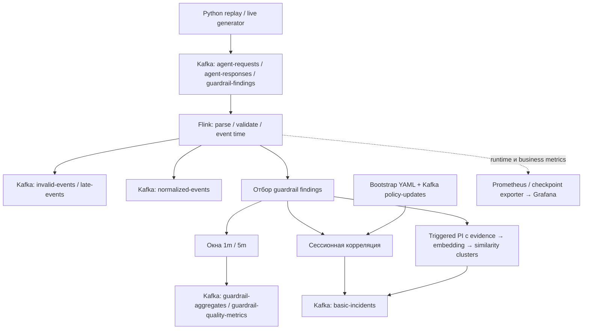

# Apache Flink для AISafety Ops банка: отчёт для управляющего директора ИТ-трайба

Дата исследования: **15 сентября 2026 года**. Срез исходного кода: **`0488760`**.

Предмет решения: NRT-обработка логов LLM-агентов, результатов guardrails и корреляция инцидентов при целевой нагрузке **50 000 входных сообщений/с**. MVP разработан вне банковского контура.

Обозначения: **✅ покрыто MVP** — реализовано в указанной границе; **⚠️ частично** — есть реализация или предварительные результаты, но недостаточно доказательств; **❌ не покрыто** — отсутствует реализация либо проверка соответствующего требования. Зелёный статус не означает готовность к промышленной эксплуатации.

## Executive summary

### Рекомендация: нужен расширенный PoC внутри банка

**Выделить 8–10 недель на проверку Flink как платформы NRT-аналитики AISafety Ops. Решение о промышленном внедрении принимать после измерения полной цепочки на банковской инфраструктуре.**

Основания:

1. **✅ Прикладная ценность подтверждена функционально.** Реализованы Kafka → Flink → Kafka, нормализация, окна 1/5 минут, корреляция инцидентов по сессии, обновления политик и поиск похожих prompt injection между сессиями одного агента. Это основа для обнаружения кампаний и расследований.
2. **⚠️ Производительность исследована только предварительно.** В документации есть минутные прогоны на общем локальном хосте с 8 доступными vCPU и одним TaskManager. DEFAULT при 400 запросах/с завершил ступень с нулевым зафиксированным lag; на 600 запросах/с отмечены backpressure и lag. У RocksDB признаки деградации появились со 100 запросов/с. Устойчивые 50K сообщений/с не доказаны.
3. **❌ Сквозной EXACTLY_ONCE отсутствует.** Настроен `AT_LEAST_ONCE`; конфигурационный enum вообще не поддерживает `EXACTLY_ONCE`. Чекпоинты сами по себе не устраняют повторные внешние действия после восстановления.
4. **❌ Предотвращение опасного ответа до его выдачи клиенту не реализовано.** Job анализирует уже поступившие результаты детекторов. Нет сервиса блокировки, подтверждения исполнения решения или ограничения времени ответа такого сервиса.
5. **⚠️ Основные ограничения масштабирования находятся и в прикладном коде.** Агрегаты хранят списки confidence для точных перцентилей; сессионное состояние содержит списки evidence; ONNX вызывается синхронно. Замена backend или увеличение числа узлов без измерений эти расходы не устраняет.
6. **❌ Банковская эксплуатационная готовность не подтверждена.** Нет HA-контура, проверенного восстановления при потере узла, сквозного аудита, защиты PII, промышленной изоляции и работающего маршрута оповещений.

**Предлагаемая граница внедрения:** Flink — обработка событий, временная корреляция и подготовка решений; быстрые guardrails перед ответом или вызовом инструмента — отдельный сервис в тракте выполнения агента. Сохранение доказательств и фактическое исполнение ограничений — отдельные компоненты с собственными гарантиями.

### Сводка покрытия

| Направление | Статус | Основание для решения |
|---|---|---|
| Разработка на Java DataStream | ✅ покрыто MVP | Работающая topology, тесты, сборка и локальный запуск |
| Удобство SQL/Table API для команды | ❌ не покрыто | Нет SQL-реализации и сравнительного замера трудоёмкости |
| Нормализация, оконные агрегаты, сессионные правила | ✅ покрыто MVP | Реализованы; для банковских данных нужна проверка контрактов |
| Join нескольких бизнес-потоков на 50K сообщений/с | ❌ не покрыто | Объединение входных topics не является join request/response/finding |
| Сквозная доставка и идемпотентное действие | ⚠️ частично | Есть checkpointing и AT_LEAST_ONCE, нет сквозного доказательства |
| Устойчивые throughput, p99 и ресурсный бюджет | ❌ не покрыто | Только короткие локальные серии и неполный паспорт стенда |
| RocksDB | ⚠️ частично | Реальный профиль и короткие измерения; нет production sizing/restore |
| Мониторинг | ⚠️ частично | 6 dashboards, Prometheus, exporter; нет alert rules и полного SLO-контроля |
| Нагрузочная методика | ⚠️ частично | Генераторы, сценарии и сборщик отчётов; нет длительного банковского НТ |
| PII, качество детекторов, inline enforcement | ❌ не покрыто | Требуются отдельные доменные проверки и интеграции |

## Основания и границы достоверности

Изучены исходный код, профили job, Docker Compose, генераторы, сборщик НТ, dashboards и документы этапов. При подготовке выполнен `bash tools/scripts/run-regression.sh`: **35 Python-тестов успешно; Java — 73 теста, 0 failures/errors, 1 skipped; BUILD SUCCESS; line coverage 82,87%**. Пропущен тест реального ONNX inference из-за отсутствия локальных файлов модели. Это функциональная проверка, не НТ.

Числа производительности ниже взяты из [раздела 9 плана НТ](load-testing-plan.md#9-результаты-short-run-baseline), датированного 4–5 сентября. Исходные per-run JSON/logs из `runtime/load-tests/` в исследованной рабочей копии отсутствуют. Прогоны в рамках этого отчёта не повторялись; точное соответствие их JAR/config текущему commit не установлено. Более поздняя similarity/ONNX-функциональность не считается проверенной этими сериями.

Технические возможности сверены с первичной документацией Apache. В проекте Flink **1.20.2**, Kafka connector **3.3.0-1.20**, broker **3.8.1**, Java runtime в Docker **17**. При сборке разрешён `kafka-clients 3.4.0`, ONNX Runtime **1.20.0**, LangChain4j **0.36.2**. Онлайн-документация ветки Flink 1.20 сейчас маркирована **1.20.3**: её описание механизмов не заменяет проверку совместимости конкретного JAR.

Оценки ресурсов, сроков и критериев PoC ниже — **инженерные предложения**, а не достигнутые результаты или согласованные банковские нормативы.

## 1. Опыт разработки

**✅ покрыто MVP:** Java DataStream API. **❌ не покрыто:** сравнительный опыт SQL/Table API и измеренная стоимость обучения команды.

### Насколько легко разрабатывать

Для опытного Java-разработчика фильтрация, преобразование и простая агрегация доступны быстро. Основная сложность возникает при работе со временем событий, восстановлением состояния и повторной доставкой. Flink переносит часть сложности из ручной реализации распределённой обработки в настройку и проверку её семантики.

| Подход | Где полезен AISafety Ops | Выигрыш | Цена и покрытие |
|---|---|---|---|
| SQL/Table API | Счётчики, группировки, окна, соединение со справочниками | Правила проще читать аналитикам; меньше служебного кода | Нужно понимать обновления результатов и state; ❌ не опробован в MVP |
| Java DataStream | Сессионная корреляция, timers, нестандартные правила | Явный контроль состояния и обработки | Больше кода и тестов; ✅ используется |
| Собственный DSL правил | Передача настройки правил аналитикам | Может уменьшить зависимость от разработки | Потребуются редактор, валидация и управление версиями; ⚠️ есть YAML-политики, полноценного DSL нет |

SQL поддерживает потоковые запросы, а оконные table-valued functions позволяют задавать временные группировки. Для PoC имеет смысл реализовать один существующий агрегат на SQL и сравнить стоимость изменения, эксплуатацию и результаты. [Apache: SQL queries](https://nightlies.apache.org/flink/flink-docs-release-1.20/docs/dev/table/sql/queries/overview/), [Windowing TVF](https://nightlies.apache.org/flink/flink-docs-release-1.20/docs/dev/table/sql/queries/window-tvf/).

### Практические сложности, уже найденные командой

- Parser мешал отправке job из-за сериализации: объект перенесён в `transient`-поле и создаётся в `open()`.
- Неверные Kafka advertised listeners в Docker приводили к перезапускам job: адреса согласованы.
- Окна получали 480 findings и не выдавали агрегатов: поток пропускал опоздания до 5 минут, а окна имели `allowedLateness=0`. После согласования настроек окон появились результаты.
- Текущий код использует generic/Kryo serialization для части состояния; изменения таких структур требуют проверки восстановления из сохранённого состояния.

Первые три случая зафиксированы в [результатах этапа 1](stage-1-results.md) и [этапа 2](stage-2-results.md). Они показывают практический опыт устранения ошибок, но не дают количественной оценки производительности разработки.

**Решение:** сохранить DataStream для корреляции; SQL оценить для стандартной аналитики. Планировать 1–2 недели погружения опытных Java-инженеров и сопровождение специалиста по Flink в течение PoC. Это оценка, проверить её можно одинаковой задачей на SQL и DataStream с фиксацией времени разработки и исправления ошибок.

**Business value:** быстрее добавлять правила и уменьшить зависимость от индивидуального знания runtime.

## 2. Функциональность и временная семантика

### 2.1 Агрегации и доменные правила

**✅ покрыто MVP:** количество findings/сработок/ошибок, суммы токенов, min/avg/max confidence и времени детектора, перцентили confidence, правила по сессии, PI+toxicity и корреляция похожих prompt injection.

Основная группировка: `agentId + guardrailName + guardrailVersion + policyVersion + modelName`. Сессионный ключ: `agentId + sessionId`. Similarity-ключ включает `tenantId`, агента, guardrail и версию embedding-модели; корреляция между разными агентами этим ключом не реализована.

**⚠️ Ограничения интерпретации:** confidence и доля сработок не являются precision/recall. Суммы токенов в разрезе guardrails нельзя автоматически складывать в стоимость LLM: один запрос присутствует в нескольких finding-событиях. Требуется отдельная дедуплицированная метрика использования модели.

**❌ Не покрыто:** фактическая точность PII/токсичности/prompt injection на банковском корпусе; CEP как отдельная библиотека; полноценное восстановление графа действий агента, tool calls и вложенных агентов. Нужны размеченные сценарии и контракт трассировки.

### 2.2 Окна

| Тип | Понятный смысл | Применение | Статус MVP |
|---|---|---|---|
| Tumbling event-time | Непересекающиеся интервалы по времени события | Сводки риска за 1/5 минут | ✅ покрыто MVP |
| Sliding/hopping | Последние N минут с пересчётом каждые S секунд | Быстро обновляемый уровень риска | ❌ не покрыто; сравнить задержку и расход state |
| Session windows | Интервал заканчивается после паузы | Сессии с естественными разрывами | ⚠️ есть собственное сессионное state с timeout 30 минут, но не штатный session-window operator |
| Count/global с trigger | Окно по числу событий или пользовательскому условию | «Последние 100 действий» | ❌ не покрыто; нужны собственные правила очистки |
| Processing-time | Интервалы по времени обработки | Оперативные технические счётчики | ❌ нет такого business window; при replay результаты могут отличаться |
| SQL cumulative | Растущий итог внутри периода | Накопительный риск | ❌ не покрыто; проверить SQL-сценарием |

Поддержка DataStream-окон и повторного выпуска при допустимом опоздании описана в [Apache Windows](https://nightlies.apache.org/flink/flink-docs-release-1.20/docs/dev/datastream/operators/windows/); SQL cumulative — в [Windowing TVF](https://nightlies.apache.org/flink/flink-docs-release-1.20/docs/dev/table/sql/queries/window-tvf/).

Текущие параметры: disorder **30 с**, период watermark **5 с**, idleness **1 мин**, allowed lateness **5 мин**. Watermark означает оценку того, какие события уже должны были прийти; это не сортировка потока.

Для непрерывного потока с согласованными часами и без очереди первая выдача минутного окна может потребовать примерно **0–60 с до его конца + 30 с disorder + до 5 с на watermark**. Для пятиминутного — примерно **0–300 + 30 + 5 с**. Это иллюстрация задержки относительно отдельного события, не SLO и не граница при отказах. Сессионные инциденты выпускаются при выполнении условий на входном событии и не обязаны ждать конца агрегатного окна.

`allowedLateness=5m` позволяет пересчитать уже выпущенное окно; оно не добавляет обязательные пять минут к первой выдаче. Получатель должен отличать новую версию итога от нового независимого итога. При полном прекращении входа event-time watermark сам по себе не обязан дойти до конца последнего окна.

**⚠️ Что нужно проверить:** задержанные findings относительно request/response, выбросы timestamp в будущее, тишина отдельных источников и повторные результаты окон. В текущей topology timestamps/watermarks назначаются после объединённого Kafka source и парсинга: комментарий YAML об idle partition нельзя считать доказательством независимого контроля каждой Kafka partition.

**Решение:** оставить 1/5 минут для аналитики; требования к быстрой реакции выполнять отдельной incident-веткой. Менять окна, watermark и lateness только после согласования допустимых пропусков и задержки.

### 2.3 Несколько потоков и 50K сообщений/с

| Механизм | Что даёт | Покрытие и следующий тест |
|---|---|---|
| Чтение нескольких topics, `union` | Общий поток; объединение результатов веток | ✅ используется; не связывает request с response |
| Broadcast/connect | Доставка небольшой политики всем обработчикам | ✅ реализовано для session rules; ⚠️ нужно проверить replay и согласованность версий |
| Interval join | Связь событий с одним ключом в ограниченном временном диапазоне | ❌ не реализован; кандидат для request/response/finding |
| Window join / co-group | Пары или пользовательская обработка двух групп в окне | ❌ не реализованы; проверить кратность и отсутствующую сторону |
| Temporal/lookup join | Обогащение версией справочника либо внешним запросом | ❌ не реализован; измерить state или задержку внешней системы |

Interval join ограничивает совпадения по ключу и времени; обычный join без временного ограничения может удерживать историю обеих сторон. Это влияет на память и восстановление. [Apache DataStream Joining](https://nightlies.apache.org/flink/flink-docs-release-1.20/docs/dev/datastream/operators/joining/), [SQL Joins](https://nightlies.apache.org/flink/flink-docs-release-1.20/docs/dev/table/sql/queries/joins/).

**50K не является гарантией API:** пропускная способность определяется числом пар, перекосом ключей, объёмом записи и длительностью хранения. При суммарном потоке двух сторон 50K/с и удержании 60 с это до **3 млн удерживаемых записей**; при условных 200 байт на запись — **600 MB полезного state**, до индексов, сериализации, служебных данных и checkpoint. Соединение many-to-many может умножить выходной поток.

**Решение:** ограниченный по времени join на `tenantId + requestId/traceId`, явно определить уникальность, таймаут ожидания и late correction. Проверить 50K/с с missing responses, дубликатами, перекосом по агентам и большими payload. **❌ Такой результат в MVP отсутствует.**

## 3. Гарантии доставки

**✅ покрыто MVP:** checkpointing каждые 30 с и Kafka sinks с `AT_LEAST_ONCE`. **❌ не покрыто:** сквозной EXACTLY_ONCE и доказанная идемпотентность downstream.

### Как достигается EXACTLY_ONCE

Flink сохраняет согласованный снимок состояния вместе с позициями источников. После сбоя обработка восстанавливается с этого снимка, а часть входа читается повторно. Внешняя запись должна участвовать в протоколе фиксации или безопасно переносить повторы.

Для Kafka sink транзакция фиксируется после успешного checkpoint. Нужны `EXACTLY_ONCE`, уникальный transactional ID prefix и consumers с `read_committed`; timeout транзакции должен учитывать checkpoint и восстановление. Фиксация создаёт дополнительное ожидание видимости выходных данных. [Apache Kafka connector](https://nightlies.apache.org/flink/flink-docs-release-1.20/docs/connectors/datastream/kafka/).

В общем случае two-phase commit разделяет подготовку внешней записи и её окончательную фиксацию. Альтернатива для приёмника — идемпотентная запись: повтор операции с тем же идентификатором не меняет результат. Идемпотентность Kafka producer защищает от части transport retries, но не от повторной отправки приложения после replay. [Apache KafkaProducer](https://kafka.apache.org/38/javadoc/org/apache/kafka/clients/producer/KafkaProducer.html), [KIP-98](https://cwiki.apache.org/confluence/spaces/KAFKA/pages/66854913/KIP-98%2B-%2BExactly%2BOnce%2BDelivery%2Band%2BTransactional%2BMessaging).

| Граница | Необходимое условие | Статус MVP |
|---|---|---|
| Источник → Flink | Возможность перечитать вход; согласованное восстановление offsets/state | ⚠️ Kafka подходит, сценарий потери узла не доказан |
| Flink → Kafka | Транзакционный sink, checkpoint, корректные timeout/IDs | ❌ enum поддерживает только `NONE`/`AT_LEAST_ONCE`, транзакции не настроены |
| Kafka → БД/хранилище инцидентов | Upsert по устойчивому ключу и правила ревизий | ❌ интеграция отсутствует |
| Инцидент → блокировка/тикет/API | Идентификатор действия, дедупликация, подтверждение, retry | ❌ отсутствует |
| Повтор события самим агентом | Стабильный event ID и дедупликация входа | ⚠️ локальная защита similarity по request ID; общей дедупликации нет |

### Существенные разрывы текущего кода

- Счётчики агрегатов и сессионных findings увеличиваются при каждом событии; уникальный список request IDs не делает эти счётчики идемпотентными.
- `KafkaSinkFactory` сериализует value без business key. Нужны ключи агрегата/инцидента, явные версии и правила применения обновлений downstream.
- `KafkaSourceFactory` выбирает `earliest()` либо `latest()`, не `committedOffsets()`. Новый submit без восстановления state может перечитать историю даже при прежнем `groupId`. Комментарии YAML о продолжении с прежних offsets не являются фактической гарантией.
- Bootstrap/broadcast policy — изменяемый вход: для воспроизводимого аудита нужно зафиксировать, какая политика действовала для события, и проверить replay с обновлениями политики.

**Решение:** в PoC сравнить Kafka EXACTLY_ONCE и AT_LEAST_ONCE с идемпотентным получателем при одинаковом SLO. Для защитных действий идемпотентность обязательна в обоих вариантах. Проверить crash до/после checkpoint/commit и сверить уникальные результаты внешним consumer. Успешный checkpoint не означает атомарного исполнения всех внешних эффектов или одновременной видимости нескольких независимых sinks.

**Business value:** повторная обработка не создаёт ложные кампании, двойные блокировки и повторные обращения в операционные команды.

## 4. Производительность и ресурсы

**⚠️ частично:** есть короткие локальные НТ. **❌ не покрыто:** устойчивые 50K сообщений/с, p95/p99 полной цепочки и промышленный ресурсный бюджет.

### 4.1 Фактические результаты

Необходимо различать **запрос агента** и **Kafka-сообщение**. В synthetic `mixed` один запрос порождает request + response + 4 findings, то есть **6 сообщений**. В таблице «сообщений/с» — расчётный предложенный поток по заданию генератору, не измеренная скорость завершённой обработки.

Условия из документа НТ: **4–5 сентября 2026**, один общий локальный хост, **8 доступных vCPU без Docker CPU quota**, **1 TaskManager / 2 slots**, **3 partitions на каждый topic**, **12 сессий**, seed **42**, ступени по **60 с**. Heap limit TaskManager указан как **512 MiB**. Пики сняты в 90-секундном окне после прогона; внутри части серий ступени шли последовательно.

| Backend | Задано запросов/с | Расчётный вход, сообщений/с | Aggregate event-to-emit, с¹ | BP, ms/s² | TM heap peak, MiB | Checkpoint max / failed³ | Kafka lag snapshot⁴ |
|---|---:|---:|---:|---:|---:|---:|---:|
| DEFAULT | 200 | 1 200 | 15,0 | 0 | 394,6 | 81 ms / 0 | 0 |
| DEFAULT | 400 | 2 400 | 8,4 | 0 | 443,1 | 122 ms / 0 | 0 |
| DEFAULT | 600 | 3 600 | 22,8 | 725 | 463,3 | 1,70 s / 0 | 101 370 |
| RocksDB | 50 | 300 | 26,9 | 0 | 400,7 | 261 ms / 0 | 0 |
| RocksDB | 100 | 600 | 22,0 | 59 | 370,2 | 226 ms / 0 | 4 802 |
| RocksDB | 200 | 1 200 | 18,9 | 648 | 446,7 | 990 ms / 1 | 9 880 |
| RocksDB | 400 | 2 400 | 56,7 | 886 | 438,8 | 1,51 s / 1 | 75 908 |
| RocksDB | 600 | 3 600 | 115,9 | 956 | 442,4 | 2,18 s / 1 | 265 364 |

Источник всех измеренных значений — [план НТ, разделы 9.1–9.5](load-testing-plan.md#9-результаты-short-run-baseline).

1. Это runtime gauge от последнего event time в агрегате до его выпуска внутри Flink. **Не p95/p99, не задержка каждого события и не доставка потребителю Kafka.**
2. Backpressure — доля времени, когда задача не может передавать данные дальше. 956 ms/s означает около 95,6% времени для наблюдаемой максимальной метрики, а не среднее всего кластера.
3. Failed — исторический накопленный счётчик job; `1` в нескольких строках нельзя складывать в несколько независимых отказов. Более новый collector рассчитывает дельту, но это не меняет методику старой таблицы.
4. Lag рассчитан по committed consumer offsets. Они обновляются с checkpoint и могут отставать от уже прочитанной позиции. Ненулевой snapshot не измеряет точное число необработанных записей; вывод о перегрузке усиливается совместно с backpressure, задержкой и длительной динамикой.

**Что можно утверждать:** короткий DEFAULT 400 запросов/с выглядел лучше RocksDB на этом стенде; DEFAULT 600 и особенно RocksDB 400/600 показывали признаки насыщения. **Нельзя утверждать:** «устойчиво обработано 400 RPS», «RocksDB в 8 раз медленнее», «Flink не справляется с 50K». Для таких выводов методика недостаточна.

Есть аномалии измерений: у DEFAULT 400 зафиксированы busy всего 1 ms/s и watermark lag 154 с при нулевом Kafka lag. Это дополнительно требует исходных временных рядов и замеров именно во время подачи нагрузки.

Функционально отдельно зафиксирован replay **720 нормализованных сообщений** на этапе 1 и **360 сообщений агрегатов 1m** на этапе 2. Последнее число включает эмиссии/обновления; это не число уникальных окон. [Stage 1](stage-1-results.md), [Stage 2](stage-2-results.md).

### 4.2 Какого паспорта стенда не хватает

| Ресурс/параметр | Что известно | Что требуется для проверки |
|---|---|---|
| CPU | 8 vCPU доступны всему хосту | Модель, частота, host contention, container CPU time/quota/throttling |
| RAM | TM heap limit 512 MiB; peaks в таблице | RAM хоста, process limits, RSS/native, Kafka/генератор/Prometheus/JM отдельно |
| Диск | Kafka и Flink работают локально; RocksDB и checkpoints на host filesystem | SSD/NVMe, IOPS, latency, throughput, свободное место, файловая система |
| Сеть | Локальная Docker-сеть | Bytes/s по входу/выходу/replication/shuffle/checkpoint; packet loss и RTT |
| Parallelism | 2 slots; embedding в текущем config имеет parallelism 1 | Сохранённый execution plan с parallelism каждого оператора для каждого прогона |
| Состояние | Используется managed state; RocksDB profile включён | Число keys/windows/timers, полное state, checkpoint delta и restore bytes |
| Нагрузка | `mixed`, 12 sessions, заданный RPS | Реальное publish/consume rate, размер payload p50/p99, число tenants/agents и доля PI |

**Два slots не равны двум CPU и не доказывают parallelism=2 у всех операторов.** Три входных topics по три partitions дают девять source splits суммарно; это не глобальный предел в три читающих задачи. Пропорции нагрузки между topics и последующее `keyBy` остаются существенными.

### 4.3 Ресурсы для 50K: расчётная рамка

При **50K сообщений/с × 2 KB = 100 MB/s ≈ 0,8 Gbit/s** только входного payload. В сутки это **8,64 TB** без сжатия. При replication factor 3 — **25,92 TB на сутки retention** только входа, до выходных topics, служебных данных и запаса. Средний payload 2 KB — допущение, его нужно измерить на обезличенной выборке.

Если бизнес подразумевает **50K запросов агентов/с**, при fan-out 6 это **300K сообщений/с**, **600 MB/s**, **51,84 TB/сутки** полезного входа. В PoC договориться об единице нагрузки до утверждения бюджета.

Число обработчиков оценивается по каждой ветке:

`parallelism ≥ ceil(входная_скорость_ветки / (измеренная_скорость_одной_subtask × целевая_загрузка))`.

При условных 5K сообщений/с на subtask и целевой загрузке 60% для ветки 50K потребуется 17 subtasks. **Это пример расчёта, не результат MVP и не заказ на 17 CPU.** Hot key не делится автоматически между subtasks; резерв на потерю узла проверяется отдельно.

**Стартовый экспериментальный бюджет PoC**, если банк не предоставляет существующую платформу:

| Компонент | Начальная конфигурация для испытаний | Статус оценки |
|---|---|---|
| Flink workers | 3–4 TaskManager по 8 vCPU / 32 GiB, локальные SSD/NVMe; попробовать parallelism 8/16/32 | ❌ не измерено; корректировать по НТ |
| Координация Flink | HA-размещение JM и долговечные metadata; ориентир 2–4 vCPU / 4–8 GiB на экземпляр | ❌ не реализовано; схема зависит от платформы банка |
| Kafka | Кластер от 3 brokers, RF=3/min ISR=2; исходный ориентир 8 vCPU / 32 GiB на broker | ❌ не sizing; диски и partitions выбирать по байтам и retention |
| Сеть и checkpoint storage | Для испытаний сеть 10 Gbit/s; внешний S3-совместимый/HDFS storage | ❌ необходим отдельный тест I/O и восстановления |
| Генераторы и наблюдаемость | Отдельные узлы, чтобы не конкурировать с job | ❌ для high-load пока не подготовлены |
| Embedding/детекторы | Отдельный CPU/GPU benchmark и бюджет | ❌ мощность из имеющихся результатов не вычисляется |

Не следует заранее покупать этот набор как промышленную конфигурацию. Он задаёт диапазон эксперимента; цену инфраструктуры нужно получить по внутренним тарифам банка.

### 4.4 От чего зависит latency

`Задержка реакции = доставка события + очередь Kafka + обработка/state/inference + ожидание условия/окна + фиксация sink + чтение и действие downstream`.

В MVP измерена лишь часть этой цепочки. Причины роста: большой payload и JSON, перегруженный ключ, доступ/сериализация state, сортировка перцентилей, синхронный ONNX, I/O, GC, watermark и транзакционная фиксация. При включении Kafka EXACTLY_ONCE и checkpoint interval 30 с часть записей будет ждать фиксации порядка интервала плюс длительность checkpoint, поэтому режим надо согласовать с SLO.

### 4.5 Backpressure: что известно и что делать

**⚠️ Наблюдался**, но доказанного устранения причины в нагрузочных сериях нет. Данные не позволяют выбрать единственную причину между state serialization, disk I/O, checkpoint, генератором и распределением задач. Небольшая загрузка CPU совместима с ожиданием I/O и не доказывает запас мощности.

Последовательность диагностики: найти занятую/блокирующую subtask → проверить её вход, state и sink → снять CPU/allocation profile и disk latency → сравнить ветки с similarity и без → менять один параметр и повторять длинную ступень. В коде уже есть предварительная фильтрация PI до embedding, лимиты кластеров и выключатель similarity; **их эффект на capacity не измерен**.

При торможении checkpoint barriers можно испытать buffer debloating/unaligned checkpoints. Они способны уменьшить ожидание checkpoint, но не увеличивают вычислительную мощность перегруженного оператора; unaligned checkpoint дополнительно сохраняет данные в буферах. [Apache: checkpointing under backpressure](https://nightlies.apache.org/flink/flink-docs-release-1.20/docs/ops/state/checkpointing_under_backpressure/).

## 5. RocksDB и стоимость состояния

**⚠️ частично:** backend и incremental checkpoints реализованы, есть короткое сравнение. **❌ не покрыто:** оптимальная настройка, длительный state churn, восстановление большого state, изменение parallelism.

### Выбор backend

| Решение | Выигрыш | Издержки | Вывод для AISafety Ops |
|---|---|---|---|
| DEFAULT/HashMap | Быстрый доступ к Java-объектам | State ограничен heap; большие object graphs и GC | Разумный baseline при небольшом ограниченном state |
| Embedded RocksDB | State может превышать heap; incremental checkpoints | Сериализация, native memory, I/O, compaction | Кандидат для большого state после исправления его структуры и НТ |
| Локальные checkpoints | Удобный автономный стенд | Общий failure domain с приложением | Достаточно для разработки, недостаточно для потери хоста |
| Внешние checkpoints | Возможность восстановить state на другом узле | Сеть, доступность storage и время загрузки | Обязательная часть банковского PoC |

RocksDB хранит сериализованные данные, использует память вне JVM heap и локальные файлы. Compaction объединяет файлы и потребляет CPU/I/O; incremental checkpoint переиспользует неизменённые SST-файлы, но переписанные файлы могут снова передаваться. Маленький размер checkpoint delta не означает маленькое полное state или быстрый restore. [Apache State Backends](https://nightlies.apache.org/flink/flink-docs-release-1.20/docs/ops/state/state_backends/), [Incremental Checkpointing](https://flink.apache.org/2018/01/30/managing-large-state-in-apache-flink-an-intro-to-incremental-checkpointing/).

### Главные находки в текущем состоянии

1. **Оконный accumulator не имеет постоянного размера.** `confidenceValues` и `triggeredConfidenceValues` сохраняют значения событий. `PercentileCalculator` копирует и сортирует список. При росте потока увеличиваются память и стоимость выпуска; для RocksDB растущий accumulator также увеличивает цену сериализации при обновлении.
2. **Сессионное state ограничено не только числом request IDs.** PI/toxicity evidence содержит записи за rolling interval. Частый поток одной сессии увеличивает списки; `ValueState<SessionRiskSnapshot>` обновляется целиком. Лимит 50 request IDs не ограничивает все эти данные.
3. **Similarity уже имеет лимиты.** Ограничены clusters, request IDs, sessions и evidence samples. Однако каждый finding вызывает линейный поиск по активным clusters и перезапись списка; глобальное число keys и timers также нужно измерять. Лимиты могут уменьшать полноту обнаружения: это должно быть видно по overflow/eviction metrics.
4. **Очистка привязана к event time.** Нужны сценарии остановившегося watermark и событий не по порядку. В session evaluator cleanup deadline вычисляется из времени текущего события; позднее событие может перенести deadline назад. Это предмет проверки семантики, не доказанный инцидент текущей эксплуатации.

Доказательства: [accumulator](../../flink-job/src/main/java/com/bank/airiskops/app/functions/GuardrailAggregateAccumulator.java), [percentiles](../../flink-job/src/main/java/com/bank/airiskops/app/support/PercentileCalculator.java), [session snapshot](../../flink-job/src/main/java/com/bank/airiskops/model/SessionRiskSnapshot.java), [similarity function](../../flink-job/src/main/java/com/bank/airiskops/app/functions/SimilarPromptInjectionCampaignFunction.java).

**Решение:** сравнить точные перцентили с ограниченными histogram/sketch-структурами на размеченных данных; цену погрешности согласовать с владельцем метрики. Для evidence — определить срок и объём хранения, рассмотреть time buckets/MapState вместо растущего общего объекта. Эти изменения могут менять результат и требуют отдельного согласования спецификации.

Для состояния измерять: bytes/key, число keys/windows/timers, стоимость read/update, RSS/native, write stalls, compaction bytes, checkpoint delta/full size и restore p95. Требование устойчивости — state выходит на ожидаемый уровень при стационарной нагрузке и освобождается согласно выбранной семантике.

**Business value:** предсказуемая стоимость обработки и восстановления, отсутствие деградации из-за «невидимой» памяти за пределами heap.

## 6. Эксплуатация и нагрузочное тестирование

### 6.1 Что построено

**✅ покрыто MVP:** Prometheus с интервалом сбора **5 с**, Flink reporter, checkpoint exporter на основе REST, Grafana provisioning и **6 dashboards**:

- Flink Overview;
- Business Metrics;
- Detector Quality;
- Incidents;
- Capacity And Performance;
- State And Checkpoint Pressure.

Есть counters валидных/невалидных/late событий, выпуска агрегатов/инцидентов, runtime contract, busy/backpressure/idle, watermark, heap/CPU, checkpoint duration/failures и конфигурация backend. [Prometheus config](../../observability/prometheus/prometheus.yml), [dashboards](../../observability/grafana/dashboards/).

**⚠️ Полнота наблюдаемости:** последние latency gauge не являются распределениями задержки; максимум по задачам не показывает среднее и может скрыть структуру перекоса; показатели quality не измеряют истинные false positives/negatives. `open_sessions` ведётся локальным gauge, поэтому после restore его соответствие восстановленному state нуждается в проверке.

**❌ Не покрыто:** alert rules и маршрутизация дежурным — в Prometheus нет `rule_files`/alerting configuration; container RSS/CPU throttling и disk I/O не образуют полного контура; нет аудируемого SLO «событие принято → решение исполнено».

### 6.2 Что необходимо для production

| Сигнал | Зачем руководству/эксплуатации | Статус и проверка |
|---|---|---|
| Возраст старейшего события, lag по partition и его производная | Понимать, насколько поздно система видит риск | ⚠️ добавить непрерывное измерение и алерт на рост |
| p50/p95/p99 ingest→output→action ACK | Проверять фактическую скорость реакции | ❌ внешний probe и histogram |
| Checkpoint age/duration/failures, restart/restore | Понимать, можно ли восстановиться | ⚠️ часть есть; провести failure drill |
| State, native memory, compaction, disk-free/latency | Предупреждать отказ до остановки обработки | ⚠️ дополнить метрики и проверить достижение порогов |
| Потеря сигналов: нет findings, ошибки/таймауты детектора | Не спутать сломанный guardrail с отсутствием атак | ⚠️ добавить freshness и сверку числа ожидаемых findings |
| Precision/recall и ручная нагрузка на triage | Измерить пользу и стоимость false alarms | ❌ размеченный корпус и shadow traffic |
| Исполнение алерта, эскалация, runbook | Превратить сигнал в управляемую реакцию | ❌ проверить доставку учебного инцидента дежурному |

### 6.3 Нагрузочный инструментарий

**✅ покрыто MVP:** Python replay/live generator, фиксированная и переменная интенсивность, `mixed`/attack/burst, late/too-late, invalid и detector-error варианты; воспроизводимые seed и идентификаторы replay. Есть [wrapper НТ](../../tools/scripts/run-nt-baseline.sh) и [collector](../../tools/reporters/nt_report_collector.py): Markdown/JSON, generator log, snapshots Kafka lag и checkpoints, интервалы settle/catch-up.

**⚠️ Проверены результатами только короткие baseline-серии.** Наличие команды для burst/late/skew не доказывает прохождение такого теста. `recovery-seconds` в wrapper означает время догоняния очереди после остановки генератора, а не искусственный отказ и восстановление Flink.

Генератор пишет через `kafka-console-producer` и последовательно публикует batches по topics. Его заданное число ticks/RPS не равно гарантированному времени доставки: запись может блокироваться и растягивать wall-clock duration. Для 50K нужен отдельный producer harness с broker ACK, фактическими messages/s и bytes/s, внешним consumer и сверкой IDs.

### 6.4 Обязательные сценарии расширенного PoC

| Сценарий | Минимальная проверка | Что решает |
|---|---|---|
| Реалистичный ramp | 5K → 10K → 25K → 50K сообщений/с; после прогрева 30–60 мин на ступень | Находит устойчивую границу |
| Длительная выдержка | 50K/с не менее 24 ч с реальной cardinality и изменениями политик | Проверяет state, compaction и накопительные эффекты |
| Burst | 100K/с 5 минут, затем возврат к 50K/с | Проверяет запас и время догоняния |
| Skew/large payload | Один агент даёт 50% входа; длинные prompts; рост tenants/sessions | Выявляет hot key и атаки на ресурсы |
| Disorder/replay | Late/too-late, future timestamps, missing response, повтор event ID | Проверяет полноту и воспроизводимость |
| Отказы | Потеря TM/JM/broker, недоступность checkpoint storage, disk-full, замедление сети | Проверяет RTO/RPO и поведение деградации |
| Restore/upgrade | Savepoint, изменение parallelism, откат версии | Проверяет сопровождаемость state |
| Similarity/ONNX | Выключено / deterministic / реальная модель; несколько долей PI | Отделяет стоимость orchestration от inference |

Все сценарии выше **❌ не подтверждены текущими результатами**. Итоговый пакет должен содержать commit/JAR hash, effective config, hardware, execution plan, входной corpus, raw time series и reconciliation report.

## 7. Архитектура MVP и целевое место Flink

**✅ покрыто MVP:** автономный односерверный Docker Compose. **❌ не покрыто:** промышленный многосерверный deployment внутри банка.

Диаграмма соответствует [topology builder](../../flink-job/src/main/java/com/bank/airiskops/app/usecase/IncrementOneTopologyBuilder.java). Входы — синтетические события или события интеграций; реальные LLM/guardrail services в Compose не развёрнуты. Similarity обрабатывает уже сработавший PI finding и не заменяет первичный PI detector. Broadcast policy подключена к session branch; similarity использует собственную конфигурацию.

Deployment содержит один Kafka broker/controller, один JobManager, один TaskManager, Prometheus, Grafana и checkpoint exporter. Topics создаются с RF=1. RocksDB profile хранит local state, checkpoints и savepoints в host-mounted `runtime/flink-state/`. Kafka data volume в Compose явно не задан; гарантии сохранения при пересоздании/потере узла не оформлены. [Docker Compose](../../deployment/local/docker-compose.yml), [topic initialization](../../tools/scripts/init-topics.sh).

**Решение для PoC:** размещать основную NRT-обработку и тяжёлую similarity/inference-обработку в управляемых ресурсных границах; при подтверждённом влиянии тяжёлой ветки выделить её в отдельную job через Kafka. Это добавляет hop и эксплуатационную единицу, но позволяет независимо задавать мощность, обновлять модель и ограничивать распространение отказов.

В целевой цепочке нужны downstream-хранилище инцидентов, доступ к защищённым evidence и интеграция с операционными системами банка. Их построение не следует считать встроенной функцией Flink.

## 8. Специфика AISafety Ops: риски и границы защиты

### 8.1 Разделить обнаружение и предотвращение

Для уже отправленного клиенту текста поздняя блокировка не отменяет утечку PII или секретов. NRT-поток может остановить дальнейшие действия, отозвать доступ, связать события в кампанию и инициировать расследование. Для предотвращения нужны проверки **перед выдачей ответа и перед опасным tool call**, либо удержание проверяемой части ответа до решения.

Это вывод из расположения обработки в архитектуре, а не утверждение, что Flink не умеет низкую latency. В данном MVP нет синхронного протокола ответа агенту и подтверждения enforcement.

| Требование домена | Статус | Необходимое решение и проверка |
|---|---|---|
| PII detection/redaction | ❌ не покрыто | Реальный детектор, размеченный банковский corpus, проверка маскирования до помещения в Kafka |
| Токсичность и PI | ⚠️ частично | Есть обработка findings/правила; измерить precision/recall на языках и сценариях банка |
| Семантические кампании | ⚠️ частично | Hash-embedding default не является доказательством качества semantic model; ONNX требует НТ и калибровки |
| Порядок событий | ⚠️ частично | request/session IDs и event time есть; нужны event ID, trace/parent IDs, sequence и правила восстановления цепочки |
| Идемпотентность | ⚠️ частично | Дедупликация общего входа и downstream actions, проверка повторов после crash |
| Аудит решения | ⚠️ частично | Версии политик/моделей частично есть; связать вход, policy, model, decision и action ACK |
| Retention | ❌ не покрыто | Сроки по raw/evidence/incidents/checkpoints, удаление из резервных копий, доступ и legal hold по требованиям банка |
| Изоляция tenants | ⚠️ частично | `tenantId` есть в модели, но отсутствует в aggregate/session keys; проверить одинаковые agent/session IDs у разных tenants |
| Fail-open/fail-closed | ❌ не покрыто | Определить поведение агента при timeout/недоступности detector или enforcement |
| Потоковый ответ и tool calls | ❌ не покрыто | Проверить утечку в первых chunks, отмену генерации и запрет необратимого действия до проверки |

В MVP `SafetyEvent` сохраняет `rawPayload`, а evidence попадает в similarity state и incident output. Нормализация **не является обезличиванием**. Нужны минимизация payload, токенизация идентификаторов, шифрование, контроль доступа и защищённые ссылки на evidence вместо бесконтрольного копирования текста. [Parser](../../flink-job/src/main/java/com/bank/airiskops/infra/parser/SafetyEventParser.java), [SafetyEvent](../../flink-job/src/main/java/com/bank/airiskops/model/SafetyEvent.java).

### 8.2 Реалистичные сценарии серьёзного инцидента

1. **Утечка уже произошла:** PII попала в ответ и raw log → NRT нашёл её позднее → инцидент открыт, но раскрытие клиенту и копирование по topics уже состоялись. Проверка: end-to-end redaction и блокировка до выдачи, включая первые chunks.
2. **Ложная кампания после replay:** новый submit читает с earliest → общая дедупликация отсутствует → счётчики PI растут повторно → downstream создаёт лишние ограничения. Проверка: одинаковый dataset до/после crash и повторного submit, сверка результатов по event/action IDs.
3. **Атака перегружает защиту:** рост triggered PI/длины evidence → синхронный inference и state updates замедляют общую topology → растут очереди и задержка остальных правил. Проверка: отдельный профиль мощности, quotas и burst/skew-тест.
4. **Смешение клиентов:** разные tenants используют совпадающий agent/session ID → состояние основной корреляции объединяется → ложный инцидент или смешанные evidence. Проверка: adversarial dataset с коллизиями ключей; согласовать tenant-aware контракт.

### 8.3 Безопасность платформы и зависимостей

**❌ Банковское усиление защиты не выполнено:** Kafka работает по PLAINTEXT, Grafana имеет локальные `admin/admin`, в Compose нет оформленных TLS/SASL/ACL/secrets/сетевых политик и production HA. Это нормально для автономного demo, но требует отдельной работы перед доступом к банковским данным.

Есть конкретный повод обновить и проверить зависимости: сборка содержит `kafka-clients 3.4.0`, попадающий в опубликованный диапазон **CVE-2026-35554**. Apache описывает race при истечении producer batch, потенциально приводящий к повреждению/неверной маршрутизации сообщений; затронуты clients 2.8.0–3.9.1, исправление в ветке 3.x — 3.9.2. Это сопоставление версии, **не доказательство проявления уязвимости в текущем single-topic sink**. Дополнительно **CVE-2026-33558** относится к раскрытию чувствительных данных в DEBUG-логах NetworkClient; client 3.4.0 также входит в диапазон. [Официальный список Kafka CVE](https://kafka.apache.org/community/cve-list/).

Решение: сформировать SBOM и совместимую обновлённую матрицу Flink/connector/client/ONNX/images, проверить её регрессией и restore-тестами. Нельзя считать обновление только broker достаточным: версия Java client в job независима. Полный security assessment этого отчёта не проводился.

## 9. Разрыв до прода и трудозатраты

Ниже — предварительная декомпозиция **банковского PoC**, а не обещание закрыть все production-требования. Человеко-неделя означает пять рабочих дней одного специалиста. Работы пересекаются; строки нельзя механически складывать. Подготовка инфраструктуры и согласования могут определять календарный срок.

| Направление | Статус | Ключевой риск | Работа и ориентир трудоёмкости | Доказательство закрытия |
|---|---|---|---|---|
| Разработка и сопровождаемость | ⚠️ частично | Ошибки semantics и миграции state | SQL spike, coding/review practices, restore compatibility: 2–3 чел.-нед. | Одинаковый результат альтернативных реализаций; контролируемое обновление |
| Функциональность и joins | ⚠️ частично | Пропуски корреляции/разрастание state | Контракты, interval join, disorder/missing events: 4–6 | Эталонный dataset и сверка всех исходов |
| Доставка и действия | ⚠️ частично | Потери/двойные действия | EOS-вариант, event/action IDs, downstream dedup: 4–6 | Отказ в каждой точке фиксации без нарушений инвариантов |
| Производительность | ❌ не покрыто | Нет мощности на 50K/с | Harness, profiling, partition/key/parallelism tuning: 5–7 | 24 ч на целевой нагрузке с SLO |
| RocksDB/state | ⚠️ частично | Рост serialization, RSS, compaction | Ограничение state, backend A/B, restore/rescale: 3–5 | Стабильный размер и измеренное время восстановления |
| Эксплуатация | ⚠️ частично | Сбой виден слишком поздно | Alerting, external latency probe, chaos/runbooks: 4–6 | Учебный инцидент обнаружен, доставлен и отработан |
| Архитектура и HA | ❌ не покрыто | Потеря хоста останавливает весь контур | Банковский deployment, checkpoint storage, backup/restore: 4–6 | Потеря узла и восстановление на другом |
| Домен/ИБ/аудит | ⚠️ частично | Утечка, неверные блокировки, смешение tenants | PII/data minimization, labelled set, shadow интеграция: 6–10 | Качество и аудит на данных банка; проверка доступа |

Отдельный полный inline guardrail-продукт, круглосуточная эксплуатация и промышленная автоматизация необратимых действий выходят за рамки такого PoC и требуют собственной оценки.

## 10. План следующего этапа, метрики успеха и стоимость

### 10.1 План на 8–10 недель

| Период | Результат | Business value |
|---|---|---|
| Недели 1–2 | Зафиксированы messages/s vs requests/s, payload, SLO, retention, ключи и банковский стенд; эталонный dataset | Исключает неверный sizing и спор о критериях успеха |
| Недели 3–4 | Проверяемая доставка, IDs/идемпотентность, ограниченный state; real-model baseline; внешняя latency-метрика | Результат становится проверяемым при сбоях |
| Недели 5–6 | НТ 50K/с, burst/skew, backend comparison, отдельная цена similarity; CPU/RAM/disk профиль | Основание для мощности и бюджета |
| Недели 7–8 | 24-часовая выдержка, отказ узла/restore/rescale, alerting и shadow AISafety Ops | Основание для эксплуатационного допуска |
| Недели 9–10 при необходимости | Исправления по НТ, повтор затронутых испытаний, расчёт TCO и решение | Снижает риск переноса известных дефектов в pilot |

Срок начинается с предоставления инфраструктуры и разрешённого набора данных. Если готовой платформы/доступов нет, планировать отдельно **2–6 недель календарного ожидания и подготовки**; фактический срок определяет банк.

### 10.2 Предлагаемые критерии успешного PoC

**Все критерии ниже — предложения к согласованию, текущий статус ❌ не подтверждены.** p99 — время, быстрее которого завершены 99% наблюдаемых операций.

| Критерий | Предлагаемый порог | Методика |
|---|---|---|
| Устойчивая нагрузка | 50K входных сообщений/с в течение 24 ч; lag не имеет устойчивого роста | Realistic payload/cardinality, включены все заявленные ветки, raw metrics |
| Быстрый NRT-инцидент | p99 ≤ 5 с от приёма последнего достаточного finding в Kafka до чтения инцидента получателем | Внешний consumer/probe; отдельно event-time freshness и inference |
| Минутные агрегаты | p99 ≤ 45 с после конца окна при нормальном disorder; дополнительный предел event→output ≤ 105 с | Согласованные часы, события ожидаемой полноты; late revisions отдельно |
| Пятиминутные агрегаты | p99 ≤ 45 с после конца окна; event→output ≤ 345 с при тех же условиях | Не смешивать задержку окна и latency вычисления |
| EXACTLY_ONCE/идемпотентность | 0 потерянных принятых валидных событий и 0 повторных бизнес-действий в тестируемой модели отказов | Эталонные event IDs, все выходные маршруты и action ACK |
| Восстановление | RTO ≤ 5 мин после потери одного узла; без потери подтверждённого входа в данной модели | Восстановление state и догоняние Kafka под входящей нагрузкой |
| Burst | 100K/с 5 мин; возврат backlog к исходному уровню ≤ 10 мин после снижения входа | Отдельно измерить нарушение latency во время burst |
| Ресурсы | Ориентир ≥30% запаса CPU/RAM/диска; state стабилизируется; нет длительных write stalls | Метрики всех subtasks и контейнеров, тест N−1 |
| Checkpoint | Успешные регулярные снимки; p99 duration < половины выбранного interval при штатной нагрузке | Порог для этого PoC, не универсальная необходимость Flink |
| Качество triage | Предварительно precision ≥90%, recall ≥95% по размеченным классам кампаний | Раздельно по типу/языку/агенту, с размером выборки и доверительными интервалами |
| PII и enforcement | Отдельный порог пропусков и latency утверждает владелец риска | Зелёный NRT-benchmark не заменяет допуск inline-защиты |
| Аудит и эксплуатация | Для 100% тестовых решений доступны input/policy/model/action; учебные alerts доставлены | Независимая выборочная проверка и failure drills |

Порог precision/recall выше относится к предложению для triage, не к допустимому риску утечки PII. Для редких тяжёлых нарушений общая accuracy непоказательна; критические случаи оцениваются отдельно.

Быстрый SLO 5 с потребует сравнения более частых checkpoint для EOS с AT_LEAST_ONCE + идемпотентным получателем. Значение 30 с из MVP нельзя сохранить автоматически и одновременно обещать эту скорость видимости Kafka output.

### 10.3 Команда и стоимость

Ориентир: **5 FTE на 8–10 недель = 40–50 человеко-недель = 200–250 человеко-дней**. Пример состава: два stream/data инженера, один platform/SRE, один QA/performance, суммарно один FTE ML/архитектора/ИБ/владельца домена. Если последние роли требуются полной отдельной загрузкой, объём увеличится.

С резервом 20–30%: **240–325 человеко-дней**. Финансовая формула:

`Бюджет PoC = 240–325 × внутренняя полная ставка за человеко-день + инфраструктура + данные/разметка + внешняя поддержка`.

**Иллюстрация, не рыночная котировка:** при условной внутренней ставке 30 000 ₽/день трудовая часть составит **7,2–9,75 млн ₽**. Ставка банка не предоставлена; расходы на стенд, GPU и разметку сверх выделенной команды неизвестны. Их нужно запросить у владельцев платформы и данных.

Для решения о проде считать не только стоимость Flink, но и Kafka retention, checkpoint storage, inference, downstream-аудит, дежурства и сопровождение. При 50K сообщений/с — **4,32 млрд сообщений в сутки**; полезные единицы TCO: ₽/млн сообщений, ₽/подтверждённый инцидент, трудозатраты triage, стоимость хранения за срок retention. Экономию относительно текущих процессов MVP не измерял.

### 10.4 Правило принятия решения

- **Внедрять в ограниченный production pilot**, если все обязательные критерии PoC пройдены, ИБ допускает обработку данных, назначен владелец эксплуатации и стоимость укладывается в бюджет.
- **Продлить только конкретный эксперимент**, если остаётся измеримый вопрос, способный изменить решение: например, цена ONNX или восстановление large state. Зафиксировать срок и критерий прекращения.
- **Не выбирать Flink для данного контура**, если сценарий сводится к простым stateless-проверкам, нет существенной временной корреляции либо стоимость платформы не оправдывается против принятой в банке альтернативы.

| Альтернатива | Когда сравнить | Что проверить |
|---|---|---|
| Существующий Kafka consumer/сервис правил | Простой поток с небольшим state | Меньше платформенных компонентов, но стоимость собственного recovery/state |
| Kafka Streams | Kafka-only приложение, есть компетенция команды | Реализация тех же окон/joins, rebalance/recovery и TCO на одном corpus |
| Хранилище аналитики с периодическим пересчётом | Допустимы минуты, главная задача — отчётность | Freshness, нагрузка запросов и стоимость хранения |
| Специализированный guardrail service | Проверка ответа/tool call до исполнения | Deadline, precision/recall, fail-open/closed и audit |

Это инженерные кандидаты для сравнения, не утверждение об их превосходстве по скорости. Транзакционная модель Kafka Streams описана в [Apache Kafka Design](https://kafka.apache.org/40/design/design/); её результативность в этом проекте не измерена.

## 11. Технические ориентиры без изменения текущего MVP

**❌ не проверено в MVP; рекомендации для отдельных экспериментов.**

| Настройка | Ожидаемый эффект | Риск | Как проверить |
|---|---|---|---|
| `state.backend.rocksdb.memory.managed` и явный memory budget TM | Контроль cache/write buffers в общем бюджете процесса | Малый бюджет усиливает I/O; heap не отражает native расход | Снять RSS, managed memory, cache misses и compaction под одинаковым state |
| `state.backend.rocksdb.timer-service.factory` | Сравнить стоимость timers в RocksDB/heap | Heap timers меняют расходы памяти и ограничения snapshot | Timer-heavy replay, checkpoint/restore и GC; не включать по умолчанию |
| `execution.checkpointing.unaligned.enabled` / buffer debloating | Уменьшение задержки checkpoint barriers при backpressure | Больше snapshot данных; не помогает от нехватки compute | A/B по alignment/start delay, checkpoint bytes и catch-up |

Основания и ограничения настроек: [Apache State Backends](https://nightlies.apache.org/flink/flink-docs-release-1.20/docs/ops/state/state_backends/), [Checkpointing under backpressure](https://nightlies.apache.org/flink/flink-docs-release-1.20/docs/ops/state/checkpointing_under_backpressure/).

На горизонте развития учитывать отделение state от compute и асинхронный доступ: они представлены во Flink 2.0/ForSt и исследовании **«Disaggregated State Management in Apache Flink 2.0», PVLDB 2025**. Эти работы направлены на ограничения локального диска, compaction и масштабирования state. Их опубликованные результаты не являются benchmark AISafety Ops. [Apache Flink 2.0 release](https://flink.apache.org/2025/03/24/apache-flink-2.0.0-a-new-era-of-real-time-data-processing/), [публикация PVLDB](https://www.vldb.org/pvldb/vol18/p4846-mei.pdf).

**Инженерный прогноз на 3–5 лет:** для этого домена наибольший практический эффект вероятнее от раздельного масштабирования inference на ускорителях и stream processing, быстрых дисков и улучшения state API. CXL/DPU не стоит закладывать как условие успеха текущего PoC: собственных измерений их пользы нет. Экономический риск для выбора Flink — отсутствие достаточно сложной корреляции: тогда существующий сервис правил и аналитическое хранилище могут дать ту же ценность с меньшими затратами.

## 12. Итог для руководства

**MVP оправдывает инвестицию в расширенный PoC. Он пока не оправдывает решение о промышленном внедрении на 50K сообщений/с.**

Подтверждена способность команды построить функциональный NRT-контур и наблюдать его работу. Не подтверждены требуемая мощность, восстановление, банковская безопасность и качество защитных решений. Проверка должна закрыть эти вопросы на одной согласованной нагрузке и с измерением полного пути до получателя/действия.

**Инженерный инвариант:** платформа пригодна, если при целевом потоке, согласованных опозданиях и отказе узла сохраняет правильность решений и сроки реакции в утверждённом бюджете.

**Предупреждение для принятия решения:** инцидент, обнаруженный после выдачи опасного ответа, не означает предотвращённую утечку.

## Приложение. Основные доказательства в репозитории

| Что проверялось | Источник |
|---|---|
| Общая архитектура | [README](../../README.md), [topology builder](../../flink-job/src/main/java/com/bank/airiskops/app/usecase/IncrementOneTopologyBuilder.java) |
| Runtime/версии | [pom](../../flink-job/pom.xml), [Compose](../../deployment/local/docker-compose.yml), [default config](../../config/job/local-job.yaml), [RocksDB config](../../config/job/local-rocksdb.yaml), [ONNX config](../../config/job/local-onnx.yaml) |
| Реальные опубликованные прогоны | [Stage 1](stage-1-results.md), [Stage 2](stage-2-results.md), [план НТ, раздел 9](load-testing-plan.md#9-результаты-short-run-baseline) |
| Delivery guarantee и offsets | [enum](../../flink-job/src/main/java/com/bank/airiskops/app/config/PipelineDeliveryGuarantee.java), [sink factory](../../flink-job/src/main/java/com/bank/airiskops/infra/sink/KafkaSinkFactory.java), [source factory](../../flink-job/src/main/java/com/bank/airiskops/infra/source/KafkaSourceFactory.java) |
| State и точные перцентили | [accumulator](../../flink-job/src/main/java/com/bank/airiskops/app/functions/GuardrailAggregateAccumulator.java), [percentiles](../../flink-job/src/main/java/com/bank/airiskops/app/support/PercentileCalculator.java), [session state](../../flink-job/src/main/java/com/bank/airiskops/model/SessionRiskSnapshot.java) |
| Tenant keys | [aggregate key](../../flink-job/src/main/java/com/bank/airiskops/app/functions/GuardrailAggregateKeySelector.java), [session key](../../flink-job/src/main/java/com/bank/airiskops/app/functions/SessionIncidentKeySelector.java), [similarity key](../../flink-job/src/main/java/com/bank/airiskops/app/functions/SimilarAttackKeySelector.java) |
| ONNX и его границы | [adapter](../../flink-job/src/main/java/com/bank/airiskops/infra/embedding/LangChain4jOnnxEvidenceEmbedder.java), [embedding operator](../../flink-job/src/main/java/com/bank/airiskops/app/functions/EmbedPromptInjectionEvidenceFunction.java), [optional model test](../../flink-job/src/test/java/com/bank/airiskops/infra/embedding/LangChain4jOnnxEvidenceEmbedderTest.java) |
| Наблюдаемость и НТ | [Prometheus](../../observability/prometheus/prometheus.yml), [dashboards](../../observability/grafana/dashboards/), [live generator](../../tools/generators/stream_live_events.py), [collector](../../tools/reporters/nt_report_collector.py) |
| Воспроизведение функциональной проверки | [run-regression.sh](../../tools/scripts/run-regression.sh), [JaCoCo отчёт после локального запуска](../../flink-job/target/site/jacoco/index.html) |

Первичные внешние источники приведены рядом с утверждениями; дата их проверки — 15.09.2026. Методика `deep-architecture-search` использована для сопоставления заявлений с кодом, анализа критического тракта, отказов и trade-offs; структура адаптирована под управленческий формат задачи.
